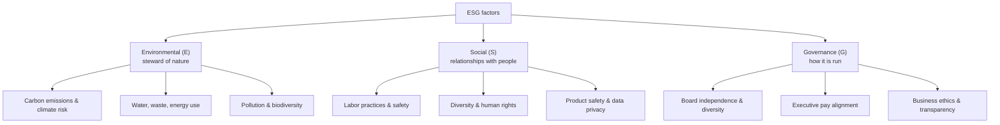
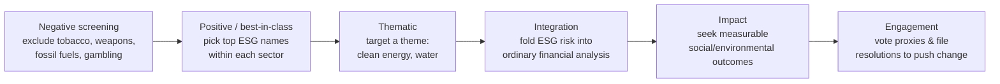

# Understanding ESG Investing

## Introduction

ESG investing evaluates companies on more than their financial statements. Alongside revenue and margins, it weighs three broad categories of **non-financial factors** — **E**nvironmental, **S**ocial, and **G**overnance — on the premise that how a company manages its environmental footprint, treats its stakeholders, and governs itself can shape its long-run financial results. The label is new, but the idea traces back through decades of socially responsible investing: religious "sin stock" exclusions, Vietnam-era divestment from defense contractors, and the 1980s anti-apartheid campaign. What changed recently is scale — ESG-oriented assets are now measured in the tens of trillions of dollars.

## The three pillars



Each pillar is a bundle of measurable issues. Note already that these are *very* different things to score — tonnes of CO₂, injury rates, and board composition don't share a natural unit. That heterogeneity is the seed of the measurement problems we return to below.

## How ESG assets grew

ESG went from niche to mainstream in about two decades, with assets under management climbing toward the tens of trillions:

```chart
esg_aum_growth()
```

Growth this fast invites both genuine adoption and marketing that runs ahead of substance — one reason scrutiny of ESG claims has intensified in step with the flows.

## Investment strategies

"ESG investing" is an umbrella over several distinct approaches, which differ in how actively they intervene:



- **Negative screening** is simple and expresses a clear ethical stance, but shrinks the investable universe and can hurt diversification.
- **Positive / best-in-class** keeps sector balance and rewards improvers, but may still hold controversial industries.
- **Thematic** and **impact** are the most concentrated — targeted exposure and (for impact) explicit outcome measurement, at the cost of higher, less diversified risk.
- **Integration** treats ESG as one more input to valuation rather than a values filter; **engagement** keeps the shares and uses ownership rights to change behavior.

## The financial case

Supporters argue ESG is not (only) about values — it is a lens on **material financial risk** that traditional analysis can miss:

- **Regulatory risk** — carbon-intensive firms face rising compliance costs and potential carbon pricing.
- **Reputational risk** — social controversies can erode brand value and customer loyalty.
- **Operational & governance risk** — weak governance precedes fraud, mismanagement, and legal blowups.
- **Stranded assets** — fossil-fuel reserves may lose economic value as the energy system transitions.
- **Supply-chain risk** — labor or environmental failures upstream can halt production.

### Materiality is the crux

The sharpest version of the case rests on **materiality**: not every ESG issue matters for every company. Water use is central for a beverage maker and nearly irrelevant for a software firm; data privacy is the reverse. Frameworks like **SASB** exist to identify which issues are *financially material by industry*. The evidence base is genuinely mixed but leans favorable: most reviews find a positive-to-neutral relationship between ESG and financial performance, with the strongest results concentrated in **material** factors rather than ESG scores in aggregate.

## The measurement problem

Here the critique bites hardest. Unlike credit ratings — where agencies agree almost perfectly — ESG ratings from different providers routinely **disagree about the same company**:

```chart
esg_rating_divergence()
```

Why the divergence?

1. **Rating divergence** — providers use different definitions, indicators, and weightings, so scores can point in opposite directions.
2. **Disclosure gaps** — many firms don't report ESG data comprehensively, forcing estimation.
3. **No universal standard** — without common definitions, cross-company comparison is fragile.
4. **Greenwashing** — companies (and funds) can exaggerate or cherry-pick ESG credentials.
5. **Data quality** — much of the input is self-reported and unaudited.

The practical consequence: a portfolio that is "high ESG" by one rater can be middling by another, which makes both performance claims and index construction sensitive to *which* data vendor you happen to use.

## A balanced view of the debate

**Supporters argue:**

- ESG factors are financially material, especially over long horizons.
- Durable value creation requires managing environmental and social risk.
- Investors have a legitimate right to align capital with their values.
- Where capital flows can nudge corporate behavior.

**Critics contend:**

- For fiduciaries, risk-adjusted return should be the sole objective.
- ESG scoring is subjective, inconsistent, and easily gamed.
- Markets already price obvious risks; a separate ESG overlay adds little.
- Some ESG mandates may be ineffective or even counterproductive.

Both sides have a point. The materiality-focused case is defensible on financial grounds; the measurement and standardization critique is real and unresolved. A careful investor treats ESG data as **one noisy input**, not gospel.

## Regulation

Disclosure rules are converging but still fragmented. The EU leads with the **SFDR**, **CSRD**, and an **EU Taxonomy** defining "sustainable" activities. The US has pursued **SEC climate disclosure** rules and **DOL guidance** on ESG in retirement plans. Internationally, the **ISSB** is working to harmonize standards. The direction of travel is toward **mandatory, standardized climate and ESG disclosure**, which should — over time — narrow the data-quality and comparability gaps that critics rightly flag.

## Key takeaways

- ESG evaluates companies on Environmental, Social, and Governance factors alongside financials.
- Strategies span a spectrum: screening, best-in-class, thematic, integration, impact, and engagement.
- The strongest financial case rests on **materiality** — ESG issues that actually move a given industry's economics.
- Evidence is mixed-to-favorable, but the effect is clearest for material factors, not ESG scores in aggregate.
- **Rating divergence** is the central weakness: providers score the same firm very differently.
- Greenwashing and self-reported data make critical evaluation essential.
- Regulation is expanding and standardizing, which should improve data quality over time.
- ESG is best treated as one noisy input to analysis — useful, but not a substitute for judgment.
