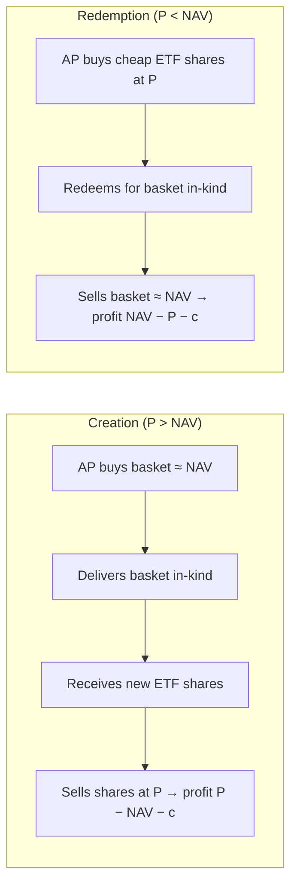

# ETFs: Diversification, Fee Drag, and the Arbitrage that Pins Price to NAV

An ETF is a securitized claim on a basket. Three quantitative facts define why the wrapper works: diversification collapses idiosyncratic variance, the fee is a deterministic geometric drag, and a creation/redemption arbitrage keeps the secondary-market price inside a narrow band around net asset value (NAV). We derive each.

## 1. Diversification: the variance floor

Let the fund hold $N$ constituents with weights $w_i$, per-name return $r_i$, variance $\sigma_i^2$, and pairwise correlation $\rho_{ij}$. Portfolio variance is the bilinear form

$$\sigma_p^2 = \sum_{i=1}^N \sum_{j=1}^N w_i w_j \,\sigma_i \sigma_j \,\rho_{ij}.$$

Take the tractable equal-weight, homogeneous case $w_i = 1/N$, $\sigma_i = \sigma$, and average off-diagonal correlation $\bar\rho$. Separating the $N$ diagonal terms ($\rho_{ii}=1$) from the $N(N-1)$ off-diagonal terms,

$$\sigma_p^2 = \frac{1}{N^2}\Big[\underbrace{N\sigma^2}_{\text{diagonal}} + \underbrace{N(N-1)\,\bar\rho\,\sigma^2}_{\text{off-diagonal}}\Big] = \frac{\sigma^2}{N} + \Big(1 - \frac{1}{N}\Big)\bar\rho\,\sigma^2.$$

Two limits matter:

- **Idiosyncratic term** $\sigma^2/N \to 0$: name-specific risk is diversifiable and vanishes at rate $1/N$.
- **Systematic floor** $\displaystyle \lim_{N\to\infty}\sigma_p^2 = \bar\rho\,\sigma^2$: correlation sets a floor you cannot diversify past.

The volatility ratio versus a single name is $\sigma_p/\sigma = \sqrt{\bar\rho + (1-\bar\rho)/N}$. With $\bar\rho \approx 0.2$ (a typical broad-equity figure), even $N \to \infty$ only cuts volatility to $\sqrt{0.2}\approx 45\%$ of a lone stock's — the ETF removes the diversifiable half and no more. That systematic residual is exactly the **market risk** an index ETF is *supposed* to retain.

```chart
diversification_smoothing()
```

The marginal benefit is steeply concave: going $1 \to 10$ names removes most idiosyncratic variance; $100 \to 500$ adds almost nothing. This is why a 500-stock and a 3,000-stock total-market ETF have nearly identical volatility.

## 2. Fee drag is deterministic geometric decay

Let gross annual return be $g$ and the expense ratio $f$, accrued daily but expressible annually as a net compounding factor $(1+g-f)$. After $T$ years, terminal wealth relative to the frictionless portfolio is

$$\frac{W_T^{\text{net}}}{W_T^{\text{gross}}} = \left(\frac{1+g-f}{1+g}\right)^{T} = \left(1 - \frac{f}{1+g}\right)^{T}.$$

Take logs and use $\log(1-x)\approx -x - x^2/2$ for small $x = f/(1+g)$:

$$\log\frac{W_T^{\text{net}}}{W_T^{\text{gross}}} \approx -\,\frac{f}{1+g}\,T \;\Longrightarrow\; \frac{W_T^{\text{net}}}{W_T^{\text{gross}}} \approx e^{-fT/(1+g)}.$$

The wealth **shortfall** is therefore $1 - e^{-fT/(1+g)} \approx fT/(1+g)$ to first order — linear in both the fee and the horizon. Concretely, at $g = 0.07$, $T = 30$: a fee gap of $\Delta f = 0.01 - 0.0003 = 0.0097$ implies a shortfall of roughly $\Delta f \cdot T/(1+g) \approx 0.0097 \times 30 / 1.07 \approx 0.27$, i.e. the 1.00% fund ends about **27% poorer** than the 0.03% ETF for identical gross performance. On a \$100,000 stake that is tens of thousands of dollars surrendered to costs alone.

```chart
expense_ratio_drag()
```

The key qualitative point: fee drag is not a one-time haircut but a *rate* applied to an exponentially growing base, so it scales super-linearly in absolute dollars even though it is linear in log-wealth. This is the quantitative spine of Sharpe's "Arithmetic of Active Management": after costs, the average active dollar must underperform the average passive dollar by exactly the cost differential.

## 3. Creation/redemption and the no-arbitrage band

APs exchange the underlying basket for ETF shares **in kind**, in creation-unit blocks. This makes ETF shares an *elastic supply*: quantity adjusts until arbitrage profit is exhausted. Let $P$ be the secondary-market ETF price and $\text{NAV}$ the fund's intrinsic per-share value.



Creation is profitable only if $P - \text{NAV} > c$, where $c$ aggregates creation/redemption fees, basket bid-ask, and hedging/transaction costs; redemption requires $\text{NAV} - P > c$. Arbitrage therefore enforces the **no-arbitrage band**

$$\lvert P - \text{NAV}\rvert \le c,$$

a soft peg. The premium/discount $\pi = P/\text{NAV} - 1$ is mean-reverting and bounded by frictions rather than pinned exactly. The band widens precisely when $c$ widens — illiquid underlyings, stale foreign closes, or stressed markets (2020's bond-ETF discounts were a live demonstration: ETF price led stale NAV, so the "discount" was largely a price-discovery lead, not a mispricing). Under stress the AP arbitrage can also *fail to engage* if inventory or balance-sheet limits bind, which is the microstructure fragility the literature flags.

## 4. Tracking error, decomposed

Define the **tracking difference** as the mean return gap and **tracking error** as its volatility:

$$\text{TD} = \mathbb{E}[R_{\text{ETF}} - R_{\text{index}}], \qquad \text{TE} = \sqrt{\operatorname{Var}(R_{\text{ETF}} - R_{\text{index}})}.$$

Write the realized gap as a sum of components:

$$R_{\text{ETF}} - R_{\text{index}} = \underbrace{-f}_{\text{fees}} \;\underbrace{-\,c_{\text{rebal}}}_{\text{transaction/rebalancing}} \;\underbrace{-\,\delta_{\text{cash}}}_{\text{cash drag}} \;\underbrace{+\,\ell}_{\text{securities lending}} \;\underbrace{+\,\varepsilon_{\text{sample}}}_{\text{sampling / optimization}}.$$

- **Expected TD** is dominated by the deterministic terms: $\mathbb{E}[\text{TD}] \approx -f - \bar c_{\text{rebal}} - \bar\delta_{\text{cash}} + \bar\ell$. Securities-lending income $\ell$ can partly (occasionally fully) offset the fee, which is why a well-run fund's tracking difference is sometimes smaller in magnitude than its headline expense ratio.
- **TE (the volatility)** comes from the stochastic pieces — sampling error $\varepsilon_{\text{sample}}$ when the fund holds a representative subset rather than the full index, plus the variance of rebalancing slippage and cash timing. For full replication of a liquid large-cap index, $\varepsilon_{\text{sample}}\to 0$ and TE is tiny; for optimized/sampled exposure (illiquid bonds, thousands of micro-caps) it is materially larger.

Because the fee enters only the *drift* and not the noise, a low-cost full-replication equity ETF exhibits near-zero TE with a tracking difference that is essentially $-f$ net of lending — the cleanest empirical signature of the mechanism.

## 5. Where the clean story breaks

- **Correlation is regime-dependent.** The floor $\bar\rho\,\sigma^2$ is not a constant: $\bar\rho \to 1$ in crashes, so diversification evaporates exactly when it is most wanted. The single-name-vs-basket smoothing is a fair-weather result.
- **Concentration inside the wrapper.** Cap-weighted indices (Nasdaq-100, S&P 500 in a mega-cap era) can have effective $N_{\text{eff}} = 1/\sum w_i^2$ far below their nominal count, so realized $\sigma_p$ sits well above the naive $\sqrt{\bar\rho}\,\sigma$ intuition.
- **NAV staleness and non-synchronous trading** make premium/discount a biased estimate of true mispricing for international and fixed-income funds.
- **AP concentration / balance-sheet limits** can decouple price from NAV in stress; the arbitrage is an inequality bounded by $c$, not an identity.
- **Leveraged/inverse and futures-based commodity ETFs** compound *daily* and suffer volatility decay and roll cost — they do **not** track the $T$-horizon index return and are a different animal entirely.

## References & further reading

- Bogle, J. C. (2007/2017). *The Little Book of Common Sense Investing* — the indexing / cost-minimization thesis.
- Sharpe, W. F. (1991). *The Arithmetic of Active Management.* Financial Analysts Journal — the algebraic proof that active must, on average, underperform passive by costs.
- Ben-David, I., Franzoni, F., & Moussawi, R. (2017). *Exchange-Traded Funds.* Annual Review of Financial Economics — microstructure, arbitrage, and price/NAV dynamics.
- Petajisto, A. (2017). *Inefficiencies in the Pricing of Exchange-Traded Funds.* Financial Analysts Journal — premiums/discounts and the no-arbitrage band.
- Madhavan, A. (2016). *Exchange-Traded Funds and the New Dynamics of Investing.* Oxford — creation/redemption plumbing and liquidity.
- Markowitz, H. (1952). *Portfolio Selection.* Journal of Finance — the variance-reduction foundation of §1.

*Educational content, not investment advice.*
