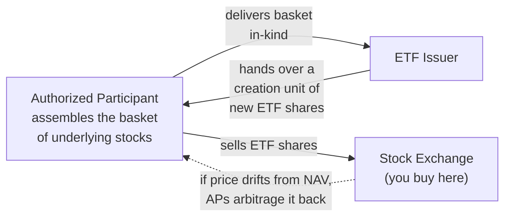

# Exchange-Traded Funds (ETFs)

## Introduction

An exchange-traded fund (ETF) is a single security that holds a whole basket of assets — stocks, bonds, commodities, or a mix. Buy **one** share and you own a proportional slice of everything inside. That one-purchase breadth is why ETFs have become a default building block for beginners assembling a first portfolio and professionals alike: they package **diversification, intraday tradability, and low cost** into a single ticker.

The defining contrast is with the traditional **mutual fund**. A mutual fund is priced once per day, after the close, at its net asset value (NAV). An ETF trades on an exchange all day long, like a stock — you can buy or sell any moment the market is open, at a live, continuously updated price.

## What an ETF actually is

When you buy one share of an ETF, you purchase a small ownership interest in *all* the assets held inside the fund. Instead of buying shares of 500 separate companies to own the S&P 500, you buy one share of an ETF that owns those 500 companies on your behalf.

Most ETFs are built to track a benchmark or follow a stated strategy. A fund manager keeps the ETF aligned with its objective by buying and selling the underlying securities as needed — for an index ETF, that mainly means adjusting holdings when the index it tracks reconstitutes.

## Diversification: the core benefit

Owning one stock ties your fate to one company's fortunes. Owning a basket spreads that risk across many, so a single blow-up barely dents the whole. When returns are not perfectly correlated, the *average* return is preserved but the **bumps cancel out** — the ride gets smoother without giving up the destination.


```chart
diversification_smoothing()
```


The green line (many holdings) and the red line (a single holding) share a similar upward drift, but the diversified path is dramatically less jagged. That smoothing is the mathematical heart of why "one basket" beats "one apple."

## Expense ratios: why small fees matter a lot

An ETF charges an annual **expense ratio** — a percentage of your assets skimmed each year to run the fund. Index ETFs are cheap (often 0.03%–0.10%); active funds charge more. The number looks trivial, but because it is subtracted *every year*, it **compounds against you**.


```chart
expense_ratio_drag()
```


Over 30 years, a 0.03% ETF and a 1.00% fund starting from the same \$10,000 diverge into a large gap — pure fee drag, before any difference in performance. This is precisely why long-term holders gravitate to the lowest-cost share class (e.g. VOO's rock-bottom expense ratio versus a pricier S&P 500 mutual fund) even when the underlying exposure is identical.

## How ETFs trade: creation and redemption

Here is the piece that makes an ETF an ETF. Special institutional firms called **Authorized Participants (APs)** can create or destroy ETF shares in large blocks ("creation units") by swapping the actual basket of underlying securities for ETF shares, and vice versa. This *in-kind* exchange is what keeps the ETF's market price tethered to the value of its holdings.





If the ETF trades **above** the value of its holdings, an AP assembles the cheaper basket, swaps it for new ETF shares, and sells them — pushing the price back down. If it trades **below**, the AP does the reverse. This arbitrage loop keeps the market price hugging NAV, and the in-kind mechanism is also why ETFs tend to be tax-efficient (few forced cash sales inside the fund).

## Index vs. active

- **Index ETFs** replicate a market index rather than trying to beat it — S&P 500, Nasdaq-100, Russell 2000, or a total-market index. Low cost, transparent, broad.
- **Active ETFs** let a manager pick holdings aiming to outperform a benchmark. They combine active management with the intraday flexibility of the ETF wrapper, but generally charge higher fees.

Common flavors along the way: **bond ETFs** (income and lower volatility), **sector ETFs** (a single slice like technology or energy), **commodity ETFs** (gold, oil — often an inflation hedge), and **international ETFs** (developed or emerging markets abroad). Well-known examples include SPY and VOO (S&P 500), QQQ (Nasdaq-100, tech-heavy and more volatile), and VTI (nearly the entire U.S. market).

## ETF vs. mutual fund at a glance

| Feature | ETF | Mutual fund |
|---|---|---|
| Pricing | Continuous, intraday | Once daily, at NAV after close |
| How you trade | On an exchange, like a stock | Through the fund company |
| Typical cost | Very low (index) | Often higher |
| Holdings disclosure | Usually daily | Often quarterly |
| Tax efficiency | High (in-kind creation) | Lower (cash redemptions) |

## The advantages, and the risks

**Advantages:** diversification from one purchase, low costs, intraday liquidity, daily transparency of holdings, and broad-market access without stock-picking.

**Risks are real, though:**

- **Market risk** — if the whole market falls, so does the ETF; diversification removes company-specific risk, not market-wide risk.
- **Sector concentration** — some indices (e.g. the Nasdaq-100) lean heavily on one industry.
- **Tracking error** — an ETF's return can drift slightly from its index because of fees and trading costs (usually small).
- **No downside protection** — you ride both the gains and the losses.
- **Liquidity risk** — niche ETFs can have wide bid-ask spreads and thin volume.

## Key takeaways

- An ETF is one ticker that owns a whole basket — diversification in a single purchase.
- Not perfectly correlated holdings preserve the average return while smoothing the ride.
- Expense ratios are tiny but compound every year; for long horizons, cost is destiny.
- ETFs trade intraday; the AP creation/redemption arbitrage keeps price ≈ NAV.
- Index ETFs track a benchmark cheaply; active ETFs try to beat one at higher cost.
- ETFs are diversified, not risk-free — market, concentration, and tracking risks remain.

*Educational content, not investment advice.*
