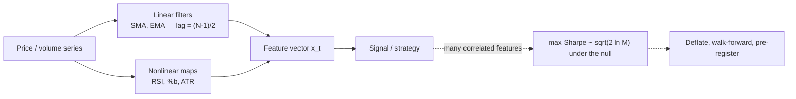

# Indicators as Filters: Lag, Smoothing, and the Multiplicity Trap

A technical indicator is a deterministic map $I_t = \phi(P_t, P_{t-1}, \dots)$ from the price/volume history to a scalar feature. Almost every classical indicator is either a **linear filter** of the price series (moving averages, MACD) or a **nonlinear function of such filters** (RSI, Bollinger %b, ATR). Viewing them as signal-processing operators makes their two universal properties precise — **lag** (phase delay) and **smoothing** (low-pass attenuation) — and exposes the real danger, which is not any single formula but the **combinatorial multiplicity** of stacking many of them.

## 1. Linear filters: SMA and EMA

The $N$-bar simple moving average is a finite-impulse-response (FIR) filter with a rectangular kernel $h_k = 1/N,\ 0 \le k < N$:

$$\text{SMA}_N(t) = \frac{1}{N}\sum_{k=0}^{N-1} P_{t-k}, \qquad H_{\text{SMA}}(\omega) = \frac{1}{N}\sum_{k=0}^{N-1} e^{-i\omega k} = \frac{1}{N}\,\frac{\sin(N\omega/2)}{\sin(\omega/2)}\,e^{-i\omega (N-1)/2}.$$

The magnitude is a Dirichlet (aliased-sinc) low-pass response that attenuates high-frequency (noisy) components — that is the *smoothing*. The phase is **linear**, $-\omega(N-1)/2$, so every frequency is delayed by the same **group delay** $\tau = (N-1)/2$ bars — that is the *lag*.

The exponential moving average is a first-order infinite-impulse-response (IIR) filter,

$$\text{EMA}_t = \alpha P_t + (1-\alpha)\,\text{EMA}_{t-1}, \qquad \alpha = \frac{2}{N+1},$$

whose unrolled impulse response is the geometric kernel $h_k = \alpha(1-\alpha)^k,\ k\ge 0$.

## 2. Derivation: why $\alpha = 2/(N+1)$

The convention $\alpha = 2/(N+1)$ is not arbitrary — it is chosen so the EMA's center-of-mass lag equals that of the $N$-bar SMA. The kernel is normalized,

$$\sum_{k\ge 0}\alpha(1-\alpha)^k = \alpha\cdot\frac{1}{1-(1-\alpha)} = 1,$$

and its mean lag (center of mass) is

$$\tau_{\text{EMA}} = \sum_{k\ge 0} k\,\alpha(1-\alpha)^k = \alpha(1-\alpha)\sum_{k\ge 1} k\,(1-\alpha)^{k-1} = \alpha(1-\alpha)\cdot\frac{1}{\alpha^{2}} = \frac{1-\alpha}{\alpha},$$

using $\sum_{k\ge1} k x^{k-1} = (1-x)^{-2}$ with $x = 1-\alpha$. Substituting $\alpha = 2/(N+1)$:

$$\tau_{\text{EMA}} = \frac{1-\frac{2}{N+1}}{\frac{2}{N+1}} = \frac{N-1}{2} = \tau_{\text{SMA}}. \qquad\blacksquare$$

So the two "$N$-bar" averages are matched precisely in first-moment lag; they differ only in the *shape* of the tail (the EMA never fully forgets, giving a longer but lighter memory). More generally, no causal linear filter can attenuate high-frequency noise without introducing positive group delay — the **lag–smoothing tradeoff is a theorem, not a tuning artifact**, and it is why crossover systems whipsaw: the delay you accept to smooth is exactly the delay that gets you in late and out late.


```chart
ema_crossover(fast=50, slow=200)
```


## 3. Momentum oscillators: nonlinear maps of filtered price

**MACD** is a *difference of two low-pass filters*, hence a band-pass filter and an approximate discrete derivative of the smoothed log-price:

$$\text{MACD}_t = \text{EMA}_{12}(P)_t - \text{EMA}_{26}(P)_t, \qquad \text{Signal}_t = \text{EMA}_{9}(\text{MACD})_t.$$

**RSI** is nonlinear. With $\Delta P_t = P_t - P_{t-1}$, up/down components $U_t=\max(\Delta P_t,0)$, $D_t=\max(-\Delta P_t,0)$, and Wilder's smoothing (an EMA with $\alpha = 1/N$, the "RMA"):

$$\overline{U}_t = \Big(1-\tfrac1N\Big)\overline{U}_{t-1} + \tfrac1N U_t, \quad \overline{D}_t = \Big(1-\tfrac1N\Big)\overline{D}_{t-1} + \tfrac1N D_t,$$

$$RS_t = \frac{\overline{U}_t}{\overline{D}_t}, \qquad \text{RSI}_t = 100 - \frac{100}{1+RS_t} = 100\cdot\frac{\overline{U}_t}{\overline{U}_t + \overline{D}_t} \in [0,100].$$

The ratio is what makes RSI nonlinear and bounded. In a persistent up-trend $\overline{D}_t \to 0$, so $\text{RSI}_t \to 100$ and the indicator *saturates*: this is exactly why "RSI > 70 ⇒ sell" fails in trends — the estimator is pinned against its bound, carrying almost no information there.

## 4. Volatility: Bollinger %b is a rolling z-score; ATR

Bollinger bands are $\text{SMA}_N \pm k\sigma_N$ with rolling standard deviation $\sigma_N$ (typically $k=2$). The normalized position **%b** collapses to an affine map of the rolling standardized price:

$$\%b_t = \frac{P_t - (\text{SMA}_N - k\sigma_N)}{(\text{SMA}_N + k\sigma_N) - (\text{SMA}_N - k\sigma_N)} = \frac{1}{2} + \frac{1}{2k}\cdot\underbrace{\frac{P_t - \text{SMA}_N}{\sigma_N}}_{z_t}.$$

So Bollinger bands are nothing more than a **rolling standardization** of price: %b is the local z-score, rescaled. This also warns you what breaks — $\sigma_N$ is a short-window volatility estimate, itself noisy and regime-dependent, so "a touch of the band" is a $\pm 2\sigma$ event only under a *stationary* local model that rarely holds.

**ATR** replaces close-to-close deviation with the gap-aware true range and smooths it with Wilder's RMA:

$$TR_t = \max\big(H_t - L_t,\ |H_t - C_{t-1}|,\ |L_t - C_{t-1}|\big), \qquad \text{ATR}_t = \Big(1-\tfrac1N\Big)\text{ATR}_{t-1} + \tfrac1N TR_t.$$

ATR gives a volatility scale in price units, which is why it belongs in the **sizing** layer: normalizing stop distance and position by ATR equalizes per-trade risk across instruments with heterogeneous variance.


```chart
bollinger_bands()
```


## 5. The real hazard: multiple testing and curve-fitting

The formulas above are benign; the danger is *how many* you try. Each indicator carries one or more parameters (windows, thresholds, $k$), and combining $c$ indicators with a handful of choices each induces a strategy space of size $M$ that grows multiplicatively. Searching that space and reporting the winner is a maximum over $M$ correlated statistics.

Under the null of **no edge**, if the in-sample Sharpe estimates $\hat{SR}_j$ are approximately Gaussian with dispersion $\sigma_{SR}$, the expected best-of-$M$ satisfies the extreme-value asymptotic

$$\mathbb{E}\Big[\max_{1\le j\le M}\hat{SR}_j\Big] \;\approx\; \sigma_{SR}\sqrt{2\ln M},$$

which **diverges without bound in $M$** purely from selection — no skill required. A battery of a dozen indicators, each with a few settings, easily reaches $M$ in the thousands, so a backtest Sharpe of 2+ is the *expected* artifact of the search, not evidence of alpha. Correlated indicators make this worse in a subtle way: they inflate the *number of trials* while adding almost no independent information, so the effective breadth of the search rises faster than its genuine informativeness.

Mitigations that actually work:

- **Deflate** the reported Sharpe for the number of trials and their correlation (Bailey–López de Prado *Deflated Sharpe Ratio*); test against $\sqrt{2\ln M}$, not against zero.
- **Walk-forward / purged cross-validation**; never optimize and evaluate on the same window.
- **Pre-register** the hypothesis and cap the parameter grid *before* looking at returns.
- Prefer a **minimal orthogonal stack** — one trend filter, one volatility scale (ATR), at most one oscillator — over a redundant, highly collinear battery.


```chart
backtest_overfit()
```





## 6. What to remember

- Indicators are **filters**: a linear indicator is fully described by its impulse/frequency response; lag and smoothing are two faces of one operator and cannot both be minimized.
- The $\alpha = 2/(N+1)$ EMA and the $N$-bar SMA share the center-of-mass lag $(N-1)/2$; that is the precise sense in which they are comparable.
- Oscillators are nonlinear reparametrizations (RSI = ratio of smoothed gains; %b = rolling z-score), so their bounds and saturations, not just their levels, carry meaning.
- The dominant failure mode of "indicator strategies" is **multiplicity**: the best of many correlated backtests is overfit by construction. Size and validate on *deflated*, out-of-sample estimates.

## References & further reading

- Wilder, J. Welles (1978). *New Concepts in Technical Trading Systems.* (Original definitions of RSI, ATR, and Wilder smoothing.)
- Lo, A. W., Mamaysky, H., & Wang, J. (2000). *Foundations of Technical Analysis: Computational Algorithms, Statistical Inference, and Empirical Implementation.* Journal of Finance 55(4).
- Bailey, D. H., & López de Prado, M. (2014). *The Deflated Sharpe Ratio: Correcting for Selection Bias, Backtest Overfitting, and Non-Normality.* Journal of Portfolio Management.
- López de Prado, M. (2018). *Advances in Financial Machine Learning.* Wiley. (Feature multiplicity, deflated Sharpe, purged/embargoed CV.)
- Harvey, C. R., Liu, Y., & Zhu, H. (2016). *… and the Cross-Section of Expected Returns.* Review of Financial Studies. (Multiple-testing thresholds for factor discovery.)
- Oppenheim, A. V., & Schafer, R. W. (2009). *Discrete-Time Signal Processing.* (FIR/IIR filters, group delay — the signal-processing backbone.)
