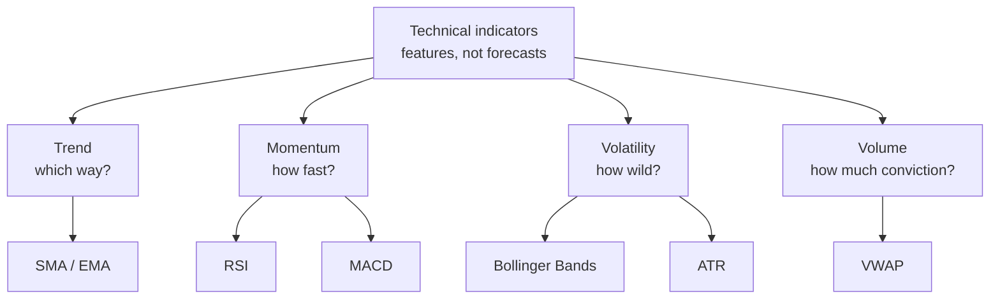

# Trading Indicators Cheat Sheet

Technical indicators do not *predict* markets on their own. They are **features** — deterministic summaries of recent price and volume that compress a noisy series into something you can read at a glance. Used well, they supply *context, risk rules, and position sizing*. Used badly (many correlated indicators stacked together), they add noise and false confidence.

## Three terms to know first

- **Lookback window** — how many bars the indicator uses (e.g. 14). Longer = smoother and slower.
- **Smoothing** — filtering out noise to reveal the underlying move, usually with a moving average.
- **Lag** — indicators react *after* price moves. Less lag usually means more noise; more smoothing means more lag. You cannot have both.

## Group the indicators by what they measure

Almost every common indicator falls into one of four buckets. Pick one from each bucket you actually need — not five that all say the same thing.

| Indicator | Type | What it measures | How to read it |
|---|---|---|---|
| SMA / EMA | Trend | Smoothed price direction | Price above a rising MA = uptrend; use as a "only-long-above" filter |
| MACD | Momentum | Gap between a fast and slow EMA | Signal-line cross = momentum is accelerating or fading |
| RSI | Momentum | Recent gains vs. losses, scaled 0–100 | >70 "overbought", <30 "oversold" — as *context*, not an auto-sell |
| Bollinger Bands | Volatility | A moving average ± k standard deviations | Band width = how volatile; a touch is not an instant reversal |
| ATR | Volatility | Average true range, in price units | Bigger ATR → wider stops and smaller position |
| VWAP | Volume | Price averaged by volume over a session | Intraday execution benchmark, not a daily forecast |





## Trend: moving averages

A moving average is just a **smoothed price**. The simple version averages the last $N$ bars; the exponential version weights recent bars more heavily so it reacts faster.

$$\text{SMA}_N(t) = \frac{1}{N}\sum_{k=0}^{N-1} P_{t-k}, \qquad \text{EMA}_t = \alpha\,P_t + (1-\alpha)\,\text{EMA}_{t-1}, \quad \alpha = \frac{2}{N+1}$$

The classic **crossover** filter goes long when a fast MA rises above a slow MA (a "golden cross") and exits when it drops back below (a "death cross"). It catches big trends but whipsaws in choppy markets — and it lags, because smoothing always costs you time.


```chart
ema_crossover(fast=50, slow=200)
```


**Common mistake:** trading MA crossovers alone, with no stop and no accounting for transaction costs.

## Momentum: RSI and MACD

**RSI** is a bounded oscillator on a 0–100 scale comparing the size of recent up-moves to down-moves:

$$\text{RSI} = 100 - \frac{100}{1 + RS}, \qquad RS = \frac{\text{average gain}}{\text{average loss}}$$

**MACD** is the difference between a fast and a slow EMA, plus a signal line that smooths that difference:

$$\text{MACD} = \text{EMA}_{12} - \text{EMA}_{26}, \qquad \text{Signal} = \text{EMA}_{9}(\text{MACD})$$

Read RSI for "how stretched" the move is and MACD for "is momentum speeding up or slowing down." **Common mistake:** treating RSI > 70 as an automatic sell during a strong trend — in a real trend RSI can sit pinned near the top for weeks.

## Volatility: Bollinger Bands and ATR

**Bollinger Bands** wrap a moving average in a volatility envelope: the band half-width is $k$ (usually 2) rolling standard deviations. Wide bands = turbulent market; narrow bands = quiet.

$$\text{Upper / Lower} = \text{SMA}_N \pm k\,\sigma_N$$


```chart
bollinger_bands()
```


**ATR (Average True Range)** measures typical bar-to-bar movement in price units. The *true range* accounts for gaps between sessions:

$$TR_t = \max\big(H_t - L_t,\ |H_t - C_{t-1}|,\ |L_t - C_{t-1}|\big)$$

ATR is then a smoothed average of $TR$. Its main job is **sizing**: place stops a few ATRs away and shrink positions in volatile names so every trade risks a comparable amount. **Common mistake:** using one fixed stop distance across assets whose ATRs differ by 10x.

## Volume: VWAP

**VWAP** is the average price weighted by volume across a session:

$$\text{VWAP} = \frac{\sum_i P_i\,V_i}{\sum_i V_i}$$

It is an execution and benchmarking tool — "did I buy better or worse than the day's volume-weighted average?" **Common mistake:** treating intraday VWAP as a predictive signal in a daily-bar strategy.

## When indicators help — and when they hurt

- **Help:** as **risk rules**, **position sizing**, and **regime context** ("only fade extremes when the trend filter says the market is ranging").
- **Hurt:** stacking many *correlated* indicators. Three momentum oscillators are not three opinions; they are one opinion repeated three times, and they make an overfit backtest look sophisticated.

## A minimal, maintainable stack

If you want something clean and robust, one indicator per job is usually enough:

- **Trend filter:** `EMA(200)` or `SMA(200)`
- **Volatility / sizing:** `ATR(14)`
- **One oscillator:** `RSI(14)` — as a filter, never the whole strategy

## Key takeaways

- Indicators are **features that summarize** price/volume, not forecasts.
- Sort them by job: **trend, momentum, volatility, volume** — and pick one per job.
- Every smoothing choice trades **lag against noise**; there is no free lunch.
- Their real value is in **risk and sizing** (especially ATR), not magic entry signals.
- More indicators ≠ more edge. Correlated indicators add redundancy, not information.
