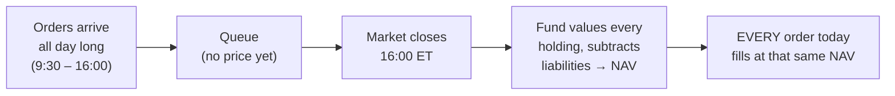

# Mutual Funds

## Introduction

A mutual fund pools money from many investors and buys a professionally managed portfolio of securities on their behalf. Buy a single share and you own a proportional slice of everything inside — often hundreds or thousands of individual positions. That is diversification in one transaction, which is why mutual funds became the default building block of retirement accounts like 401(k)s and IRAs.

The fund's defining mechanic, and the thing that separates it from an ETF, is **how it is priced**. A mutual fund does not trade continuously. Every order placed during the day — buy or sell — is executed at one single price struck after the market closes.

## What a mutual fund actually is

When you buy shares, your money joins a common pool. A portfolio manager invests that pool according to a stated objective: long-term growth, current income, capital preservation, or some blend. The objective is not a marketing slogan; it is a legal commitment set out in the fund's **prospectus**, along with the securities the fund may hold, its risks, its fees, and its strategy. Reading the prospectus is the single most informative thing an investor can do before buying.

## Net asset value and forward pricing

The fund's per-share value is its **net asset value**:

$$
\text{NAV} = \frac{\text{Total assets} - \text{Total liabilities}}{\text{Shares outstanding}}
$$

A fund holding \$500,000,000 in assets against \$10,000,000 of liabilities, with 49,000,000 shares outstanding, has a NAV of

$$
\frac{500{,}000{,}000 - 10{,}000{,}000}{49{,}000{,}000} = 10.00
$$

or \$10.00 per share.

Orders are filled at the NAV struck *after* the order is placed — a convention called **forward pricing**. Place an order at 10:30 a.m. and you do not know your execution price; you receive the close. This is deliberate, and it is a genuine investor protection: it is what blocks the late-trading and market-timing abuses that arise when someone can transact at a stale, already-known price.



## Diversification: the point of pooling

Owning one stock ties your outcome to one company. Owning a broad basket spreads it. Because holdings are not perfectly correlated, the average return survives while the bumps partly cancel — the destination is preserved and the ride smooths out.

```chart
diversification_smoothing()
```

The diversified path and the single-holding path drift upward at a similar rate, but the diversified one is far less jagged. That smoothing is the mathematical reason pooling works, and it is available to a \$500 investor and a \$500,000 investor on identical terms.

## Types of mutual funds

- **Equity funds** hold stocks and target long-term capital appreciation. Sub-flavours include large-cap, small-cap, international, growth, and value.
- **Bond funds** hold fixed income — government and corporate debt. They aim at income with lower volatility than equity.
- **Money market funds** hold short-term, high-quality debt such as Treasury bills and commercial paper. They prioritise capital preservation and liquidity, making them the lowest-risk category.
- **Balanced funds** hold a stock/bond mix for a middle risk profile in one product.
- **Index funds** replicate a benchmark rather than trying to beat it — the S&P 500, the Nasdaq-100, the Russell 2000, or a total-market index. Less active management means materially lower fees.

## Active versus passive

An **active** fund employs managers to research companies and trade in pursuit of beating a benchmark. The upside is genuine: security selection can add value, and a manager has the flexibility to react to changing conditions. The costs are equally genuine — higher management fees, greater trading costs, and more taxable distributions from frequent turnover. The persistent empirical finding is that a majority of active funds underperform their benchmark over long horizons, and that the minority which outperform are difficult to identify in advance.

A **passive** fund simply tracks its index. It cannot beat the index before fees, and it holds declining companies until the index drops them. In exchange it offers low expense ratios, high tax efficiency, broad diversification, and a strategy you can predict.

## What it costs

Fees are not a footnote. They are subtracted every year from a compounding base, so their effect grows with the horizon.

**Expense ratio** — the annual percentage of assets taken to cover management and operating costs. At 0.75%, you pay roughly \$7.50 a year per \$1,000 invested.

```chart
expense_ratio_drag()
```

Over thirty years, two funds with identical gross performance but different expense ratios diverge into a large gap. Nothing about that gap reflects skill; it is pure fee drag.

**Sales loads** — commissions charged on top:

- **Front-end loads** are paid when you buy.
- **Back-end loads** are paid when you sell.
- **No-load funds** charge no sales commission at all, which is why they now dominate flows.

## Commonly held categories

- **S&P 500 index funds** — exposure to 500 of the largest U.S. companies.
- **Total stock market funds** — thousands of U.S. companies across large, mid, and small caps.
- **Target-date retirement funds** — automatically shift from stocks toward bonds as a retirement year approaches.
- **Total bond market funds** — diversified investment-grade government and corporate debt.
- **International stock funds** — companies outside the U.S., for global diversification.

## Mutual fund versus ETF

| Feature | Mutual fund | ETF |
|---|---|---|
| Pricing | Once daily, at NAV after close | Continuous, intraday |
| How you trade | Through the fund company | On an exchange, like a stock |
| Minimum investment | Often a fixed dollar minimum | Price of one share |
| Automatic recurring buys | Easy, in exact dollar amounts | Depends on the broker |
| Tax efficiency | Lower — cash redemptions can force sales | Higher — in-kind creation |

The companion article on ETFs covers the creation/redemption machinery that produces that last row.

## The trade-offs

**In favour:** professional management, instant diversification, easy automatic investing in round dollar amounts, a strategy for nearly every objective, and a structure that suits long-horizon retirement saving.

**Against:** fees reduce returns every year; most active funds trail their benchmarks; you cannot trade intraday; you have no say in individual holdings; and — the one that surprises people — a fund can distribute **taxable capital gains** to you even in a year when you sold nothing and the fund lost money, because the distribution is driven by the manager's realised trades, not yours.

## Key takeaways

- A mutual fund is a pooled, professionally managed portfolio; one share buys a slice of everything it holds.
- Pricing happens once per day at NAV, and forward pricing means you cannot know your execution price in advance.
- Imperfectly correlated holdings preserve the average return while smoothing the path.
- The expense ratio is small per year but compounds against you every year; over decades, cost is destiny.
- Index funds track a benchmark cheaply; active funds try to beat one, usually at higher cost and with mixed success.
- Watch for loads, and remember that capital gains distributions can create a tax bill in a year you did not sell.

*Educational content, not investment advice.*
