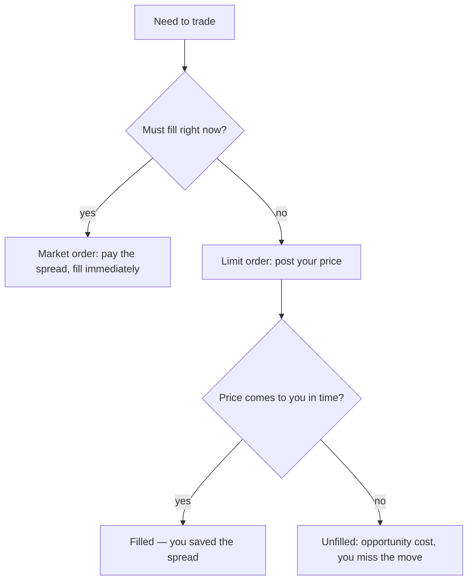
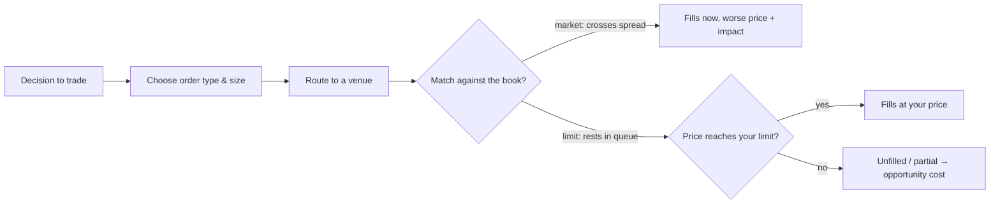

# Orders, Slippage & Transaction Costs

Many "great" strategies quietly disappear once you trade them for real. The culprit is rarely the idea — it's **execution**. The price on your screen is not the price you get, and the gap between the two is where paper profits go to die. This article covers the plumbing every trader has to respect: order types, the bid-ask spread, slippage, commissions, and how these frictions turn a paper edge into a smaller, real one.

## Key terms

- **Spread** — the difference between the best bid (highest price buyers will pay) and the best ask (lowest price sellers will accept). Crossing it costs money.
- **Slippage** — getting a worse price than you expected, common in fast markets, thin liquidity, or with large orders.
- **Market impact** — your *own* order pushing the price against you as it fills.
- **Liquidity** — how much size you can trade without moving the price.

## Order types

### Market order
Buy or sell **immediately** at whatever price is available.

- **Pros:** fast, near-certain fill.
- **Cons:** you pay the spread and can suffer large slippage in volatile or thin markets — you take whatever the book offers.

### Limit order
Trade only **at your price or better** (e.g. "buy at \$50.02 or lower").

- **Pros:** you control price and can avoid paying the spread — you might even earn it.
- **Cons:** you may not fill at all; **queue priority** matters, and while you wait the price can run away from you.

### Stop / stop-limit
An order that activates once price crosses a trigger. Used for exits and risk control. A **stop** becomes a market order when hit (guaranteed fill, uncertain price); a **stop-limit** becomes a limit order (controlled price, uncertain fill). In fast moves stops can trigger and fill far worse than the trigger level.





## The bid-ask spread and the order book

Every liquid market is really a stack of resting orders — an **order book**. Buyers post **bids** below; sellers post **asks** above. A market buy climbs into the asks; a market sell drops into the bids.


```ascii
        ASKS  (resting sell orders)
   $50.06   ▓▓▓      300            ↑ higher price
   $50.05   ▓▓▓▓▓    500
   $50.04   ▓▓       200   ← best ask  (a market BUY fills here)
   ---------------------------------  spread = $0.02
   $50.02   ▓▓▓      400   ← best bid  (a market SELL fills here)
   $50.01   ▓▓       250
   $50.00   ▓▓▓▓▓▓   700            ↓ lower price
        BIDS  (resting buy orders)
```


The **mid-price** here is \$50.03, but nobody trades there. A market buyer pays \$50.04; a market seller receives \$50.02. Each side gives up the **half-spread** (\$0.01, about 2 bps on a \$50 stock). Buy *and* later sell and you pay the **full spread** — roughly 4 bps round-trip — before your idea has done anything.

When your order is larger than the size sitting at the best price, it **walks the book**: it fills the 200 shares at \$50.04, then the next 500 at \$50.05, and so on. That climb is **market impact** — you moved the price against yourself.

## An order's lifecycle

From click to fill, a lot can go wrong:





Even a "simple" order passes through routing and latency: by the time it reaches the venue, the quote may have moved. That delay is one more source of slippage.

## Why slippage happens

- **Spreads widen** during volatility and around news — exactly when you most want to trade.
- **Order-book depth is limited** — large orders walk the book and move the price.
- **Latency and routing** — price moves in the milliseconds between your click and the fill.

## Modeling costs (start simple)

For a first pass, subtract three things from every trade:

$$\text{Net edge} = \text{Gross edge} - \text{Commission} - \text{Spread cost} - \text{Slippage}$$

A workable slippage model scales with volatility and size relative to how much the market normally trades:

$$\text{Slippage} \;\approx\; k \cdot \sigma \cdot \sqrt{\frac{Q}{V}}$$

where $\sigma$ is volatility, $Q$ is your order size, $V$ is the typical volume, and $k$ is a fitted constant. Bigger size and higher volatility mean more slippage — and it grows with the **square root** of size, not linearly (more on that in the quant tier).

## From paper edge to real edge

Here is the punchline. Suppose a strategy shows a **gross** edge of 10 bps per trade. Realistic costs might be 1.5 bps commission, 2.5 bps spread, and 3.0 bps slippage:

10.0 − 1.5 − 2.5 − 3.0 = **3.0 bps net**. The costs ate 70% of the edge.


```chart
slippage_costs()
```


A tiny per-trade cost is deadly precisely because you pay it **over and over**. Like a fee that compounds, a recurring drag on returns snowballs into a large gap over time — the more you trade, the more it bites:


```chart
expense_ratio_drag()
```


This is why turnover is the enemy of a small edge: a strategy that trades 500 times a year pays 500 spreads. If your gross edge per trade is smaller than your cost per trade, a beautiful backtest becomes a losing live account.

## Practical guidance

- **Prefer lower turnover** if your edge per trade is small — every extra trade is another spread paid.
- **Use limit orders** when you're not in a hurry; use market orders only when a fill is worth more than the spread.
- **Size to liquidity** — keep orders small relative to typical volume so you don't walk the book.
- **Model fills realistically** in backtests: a fixed spread cost, a per-trade fee, and a volatility-and-size slippage term.
- **Always measure performance *after* costs**, and report turnover and average trade size alongside returns.

## Key takeaways

- The screen price is not your fill price; the spread, slippage, and commissions sit in between.
- **Market orders** buy certainty of fill and pay the spread; **limit orders** buy price control and risk not filling.
- Large orders **walk the book** and create their own market impact; slippage grows like $\sqrt{Q/V}$.
- Costs are paid **per trade**, so high turnover multiplies them — a paper edge must clear its costs to survive.
- Judge every strategy on **net-of-cost** returns, not gross.
