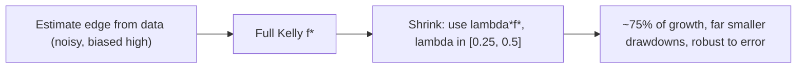

# Position Sizing: Growth-Optimal Betting and Its Discontents

## 1. The problem, stated properly

Let wealth evolve multiplicatively. Over $n$ i.i.d. rounds with per-round gross return $R_i(f) > 0$ depending on the risked fraction $f$,

$$W_n = W_0 \prod_{i=1}^{n} R_i(f), \qquad \frac{1}{n}\log\frac{W_n}{W_0} = \frac{1}{n}\sum_{i=1}^n \log R_i(f) \xrightarrow{\text{a.s.}} g(f) := \mathbb{E}[\log R(f)]$$

by the strong law of large numbers. The **almost-sure exponential growth rate** is therefore $g(f) = \mathbb{E}[\log R(f)]$, and the growth-optimal (Kelly) fraction is

$$f^\star = \arg\max_{f} \; \mathbb{E}[\log R(f)].$$

Maximizing expected *log* wealth — not expected wealth — is the correct objective for a repeatedly-compounded process: expected wealth is maximized by betting everything, which drives $W_n \to 0$ almost surely. This is the resolution of the St. Petersburg-style tension: $\mathbb{E}[W_n]$ and the typical (median) path diverge wildly under multiplicative dynamics.

## 2. Derivation for a discrete bet

For a bet returning $+b$ per unit with probability $p$ and $-1$ per unit with probability $q=1-p$, risking fraction $f$:

$$g(f) = p\log(1 + bf) + q\log(1 - f).$$

$$g'(f) = \frac{pb}{1+bf} - \frac{q}{1-f} = 0 \;\Longrightarrow\; pb(1-f) = q(1+bf) \;\Longrightarrow\; \boxed{f^\star = \frac{bp - q}{b} = p - \frac{q}{b}}.$$

$g$ is strictly concave on $(0,1)$ since $g''(f) = -\tfrac{pb^2}{(1+bf)^2} - \tfrac{q}{(1-f)^2} < 0$, so $f^\star$ is the unique interior maximizer whenever the edge $bp - q > 0$. Two structural facts:

- **Growth is zero at $f=0$ and at $f = 2f^\star$ (to first order).** By concavity and $g(0)=0$, there is a second root $f_0 > f^\star$; for symmetric even-money bets ($b=1$) one finds $f_0 = 2p-1 \cdot(\dots)$, and empirically doubling Kelly annihilates the growth advantage. Over-betting is not "more aggressive growth" — it is *negative* growth.
- The map is dramatically asymmetric around $f^\star$.

```chart
kelly_curve(p=0.6, b=1)
```

## 3. Continuous-time / Gaussian case (Merton fraction)

Let the risky asset follow geometric Brownian motion $dS/S = \mu\,dt + \sigma\,dW$ and let $f$ be the constant fraction allocated. Portfolio wealth obeys $dW/W = f\,dS/S = f\mu\,dt + f\sigma\,dW$, and by Itô,

$$d\log W = \left(f\mu - \tfrac{1}{2}f^2\sigma^2\right)dt + f\sigma\,dW.$$

The drift of $\log W$ **is** the growth rate; maximizing $f\mu - \tfrac12 f^2\sigma^2$ gives

$$f^\star = \frac{\mu}{\sigma^2}, \qquad g(f^\star) = \frac{\mu^2}{2\sigma^2} = \tfrac{1}{2}\,\text{SR}^2,$$

i.e. the growth-optimal leverage is the Sharpe ratio divided by volatility, and optimal growth equals half the squared Sharpe ratio. The $-\tfrac12 f^2\sigma^2$ term is the **volatility tax** (variance drain) that penalizes over-leverage — the continuous analogue of the discrete over-betting collapse.

## 4. Fractional Kelly and estimation risk

You never know $\mu, \sigma, p$ — you estimate them, and the objective is flat-to-the-right and steep-to-the-left of $f^\star$. Expand $g$ near the optimum:

$$g(\lambda f^\star) \approx g(f^\star)\big(1 - (1-\lambda)^2\big)\ \text{(quadratic penalty)}.$$

So **half-Kelly** ($\lambda = \tfrac12$) retains $\approx 75\%$ of the maximal growth rate while roughly halving volatility and quartering the variance of the drawdown process. Under parameter uncertainty, $f^\star$ estimated from data is itself a random variable biased high (edge is overestimated in-sample), so shrinkage toward zero is not merely conservative — it is closer to the Bayes-optimal action. Simulated median trajectories:

```chart
kelly_wealth_paths(p=0.6, b=1)
```



## 5. Drawdown, ruin, and the geometry of risk

For continuous Kelly betting the running maximum drawdown $D$ satisfies $\mathbb{P}(D \ge x) = (1-x)^{(2/\text{[fraction ratio]})}$-type bounds; a clean result is that betting fraction $\lambda f^\star$ gives a probability of ever halving your capital of approximately $2^{-(1/\lambda - 1)}$ under the GBM model — full Kelly ($\lambda=1$) has a ~50% chance of a 50% drawdown, half-Kelly far less. This is why full Kelly is essentially never used by practitioners despite being growth-optimal: **investors have finite tolerance for path pain and finite horizons**, and the utility of the median path dominates the utility of the mean.

## 6. Where the model breaks

- **Fat tails.** Kelly assumes the loss is bounded and the distribution known. Real returns are heavy-tailed; a Gaussian $\mu/\sigma^2$ badly *over*-sizes when the true distribution has power-law tails, because the rare large loss dominates $\mathbb{E}[\log R]$. Compare the tail mass a Gaussian ignores:

```chart
normal_vs_fat_tail(nu=2)
```

- **Non-stationarity.** $\mu, \sigma$ drift with regime; a fraction optimal in one regime is ruinous in another. Regime-aware or time-varying sizing is required.
- **Estimation error & multiplicity.** Selecting the best of many strategies inflates the apparent edge (selection bias, the "deflated Sharpe" problem, López de Prado). Size on *deflated* estimates.
- **Correlation = hidden leverage.** For a portfolio, the scalar $f$ becomes a vector and $f^\star = \Sigma^{-1}\mu$ (continuous case). Correlated bets are effectively one larger bet; ignoring $\Sigma$ silently multiplies portfolio heat.

## 7. Portfolio generalization

With a vector of excess returns $\mathbf{r} \sim (\boldsymbol\mu, \Sigma)$ and weight vector $\mathbf{f}$, the log-growth drift is $\mathbf{f}^\top\boldsymbol\mu - \tfrac12 \mathbf{f}^\top\Sigma\mathbf{f}$, maximized at

$$\mathbf{f}^\star = \Sigma^{-1}\boldsymbol\mu,$$

the (unconstrained) tangency/Kelly portfolio. This is the rigorous version of "diversify and discount correlated positions": $\Sigma^{-1}$ down-weights redundant exposures. Practical portfolio heat is a scalar projection of $\mathbf{f}^\top\Sigma\mathbf{f}$.

```chart
portfolio_heat(risks=(1.5, 1.0, 2.0, 0.8, 1.2))
```

## References & further reading

- Kelly, J. L. (1956). *A New Interpretation of Information Rate.* Bell System Technical Journal.
- Thorp, E. O. (2006). *The Kelly Criterion in Blackjack, Sports Betting, and the Stock Market.*
- Merton, R. C. (1969). *Lifetime Portfolio Selection under Uncertainty.* Rev. Econ. Stat.
- MacLean, Thorp & Ziemba (eds., 2011). *The Kelly Capital Growth Investment Criterion.*
- López de Prado, M. (2018). *Advances in Financial Machine Learning* (deflated Sharpe, bet sizing).
- Vince, R. (1990). *Portfolio Management Formulas* (optimal-f, drawdown geometry).
