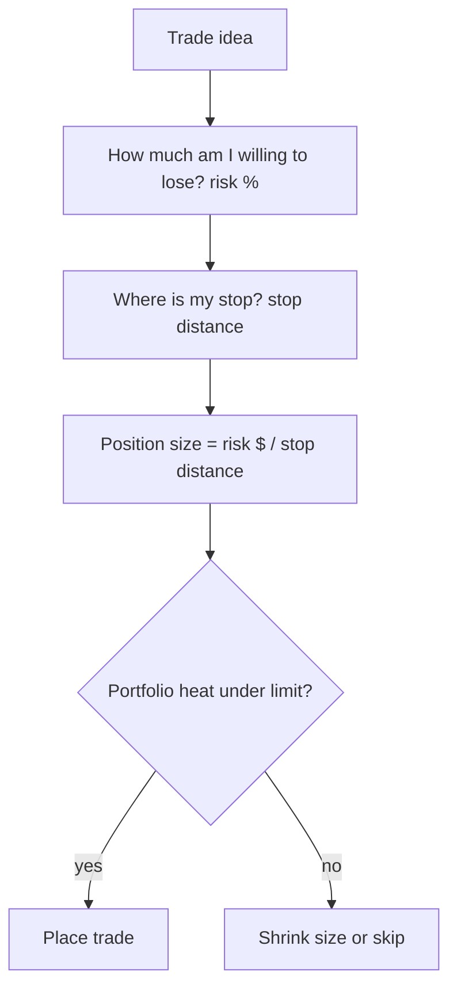

# Position Sizing & Risk Management

## Introduction

Position sizing answers the single most important question in trading: **how much capital do I put on this trade?** You can be right about direction and still blow up if you size wrong — and you can have a mediocre edge and still compound steadily if you size right. Sizing, not stock-picking, is what separates survivors from statistics.

The decision flow looks like this:





## Key Concepts

### 1. The Kelly Criterion

The **Kelly criterion** gives the bet fraction that maximizes long-run *compound* growth, given your edge:

$$f^\star = \frac{bp - q}{b}$$

- $f^\star$ = fraction of capital to wager
- $b$ = payoff odds (win $b$ per $1$ risked)
- $p$ = probability of winning, $q = 1 - p$

Kelly is a knife-edge. Bet *less* than $f^\star$ and you grow slower but safer; bet *more* and growth actually **falls** — past a point it goes negative and you head toward ruin even with a winning system.


```chart
kelly_curve(p=0.6, b=1)
```


The reason over-betting is so dangerous is that wealth **multiplies**, it doesn't add. A 50% loss needs a 100% gain to recover. Simulating repeated bets makes the punishment obvious:


```chart
kelly_wealth_paths(p=0.6, b=1)
```


Most practitioners bet **half-Kelly** or less: it keeps ~75% of the growth with far smaller drawdowns and much more robustness to estimation error (you never really know $p$ exactly).

### 2. Fixed Fractional Method

A simpler, extremely common rule: risk a fixed percentage of the account per trade, translated through your stop.

$$\text{Position Size} = \frac{\text{Account Balance} \times \text{Risk \%}}{\text{Stop-Loss Distance}}$$

### 3. Volatility-Based Sizing

Scale size *inversely* to volatility so every position risks a comparable amount. Using Average True Range (ATR):

$$\text{Position Size} = \frac{\text{Risk Amount}}{\text{ATR} \times \text{ATR Multiplier}}$$

More volatile asset → wider expected swing → **smaller** position. This equalizes risk across instruments.

## The 2% Rule and Stop Distance

The stop is what turns "risk %" into a share count. Risk lives in the gap between entry and stop:


```ascii
  entry $50 ───────────────●  (buy here)
                           │  stop distance = $3  = the risk per share
  stop  $47 ───────────────○  (exit here if wrong)

  Risk $1,000  ÷  $3 per share  =  333 shares
```


**Worked example:**

- Account Balance: \$100,000
- Risk per trade: 1% (\$1,000)
- Entry: \$50, Stop: \$47 → stop distance \$3

$$\text{Position Size} = \frac{\$1{,}000}{\$3} \approx 333 \text{ shares}$$

If price hits the stop you lose exactly your planned \$1,000 — 1% of the account — no matter how the trade *feels*.

## Portfolio Heat

Individual trades are fine; it's the **sum** of open risk that kills accounts. Portfolio heat is total risk across all positions:

$$\text{Portfolio Heat} = \sum_{i=1}^{n} \text{Risk}_i$$


```chart
portfolio_heat(risks=(1.5, 1.0, 2.0, 0.8, 1.2))
```


Keep total heat below ~6–8% of capital. And because correlated positions move together, discount their sizes:

$$\text{Adjusted Size} = \frac{\text{Base Size}}{1 + \text{Correlation Factor}}$$

## Risk Management Rules

1. **Never risk more than 1–2% of the account on a single trade.**
2. **Diversify across uncorrelated assets** — correlation is hidden leverage.
3. **Use a stop on every position** — it defines the risk that makes sizing possible.
4. **Monitor portfolio-wide heat**, not just single-trade risk.
5. **Prefer fractional Kelly** to full Kelly — you don't know your edge exactly.

## Key Takeaways

- Position sizing controls *survival*; it matters more than entry timing.
- Kelly maximizes compound growth, but the penalty for over-betting is severe and asymmetric — half-Kelly is the pragmatic default.
- Convert a fixed risk % into a share count through your **stop distance**.
- Scale inversely to volatility so each trade risks the same.
- Watch **portfolio heat** and correlation, not just individual trades.

