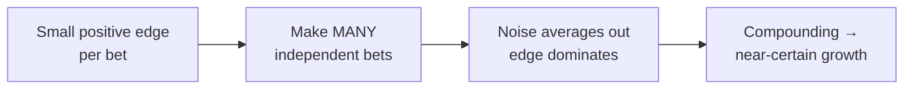
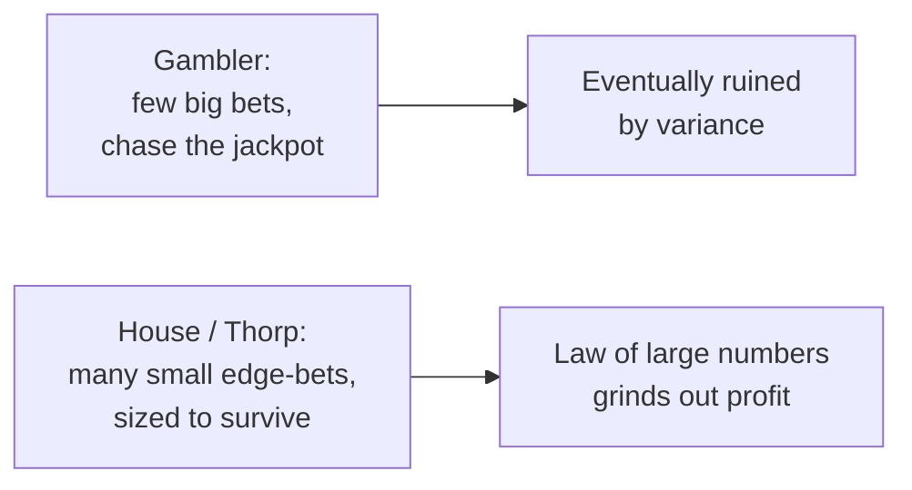

# The Thorp Edge Principle: More Bets, Not Bigger Bets

> "Casino gambling with a system where you have the edge is a wonderful teacher for elementary money management." — Ed Thorp

## The man who beat the house

Ed Thorp is arguably the most influential money manager most people have never heard of:

- **1962** — published *Beat the Dealer*, proving blackjack could be beaten with card counting.
- **1961** — with Claude Shannon, built the first wearable computer to beat roulette.
- **Pre-1973** — independently derived option-pricing math close to Black–Scholes, and *traded* on it instead of publishing.
- **1969** — founded Princeton–Newport Partners, an early quantitative hedge fund, which posted **227 winning months out of 230**.
- **Legacy** — became Citadel's first outside investor, mentoring a young Ken Griffin.

It all started at the blackjack table, with one insight about probability that most people miss.

## The casino's secret

Casinos don't gamble. They understand a simple truth:

> **They have a small edge on every game. They let everyone play. They let the math do the rest.**

A casino's 1–2% house edge means nothing on a single spin — on any one bet the casino can easily lose. But multiplied across *millions* of small bets, that tiny edge becomes billions in near-certain profit. Thorp reversed the logic: with card counting he found the rare situations where **the player** had the edge, then did exactly what the house does — made as many small favorable bets as possible.

## Edge vs. variance: why frequency wins

Here is the mechanism behind the whole principle. Say each bet has a small positive expected value (the **edge**, $\mu$) and some randomness (the **volatility**, $\sigma$). Add up $N$ independent bets:

- Your accumulated edge grows in proportion to $N$ — it scales like $N\mu$.
- Your accumulated randomness grows only in proportion to $\sqrt{N}$ — it scales like $\sigma\sqrt{N}$.

So the **signal-to-noise ratio** of your total profit grows like

$$\frac{N\mu}{\sigma\sqrt{N}} = \frac{\mu}{\sigma}\sqrt{N}.$$

Edge grows faster than noise. The more bets you make, the more the randomness averages out and the more the edge dominates. The probability of finishing profitable after $N$ bets is approximately $\Phi\!\left(\frac{\mu}{\sigma}\sqrt{N}\right)$, where $\Phi$ is the normal CDF — and it marches toward certainty:


```chart
many_small_bets(edge=0.02)
```


A 2% edge is a coin flip on a single bet. Over 400 bets it is nearly a sure thing. **That is the Thorp edge principle: breadth — the number of bets — is the lever, not size.**

## Breadth in the cross-section: be the house

You can add breadth two ways: across **time** (more bets in a row) and across **markets** (many uncorrelated bets at once). A casino runs hundreds of tables simultaneously; a quant fund trades hundreds of instruments. Spreading the same edge across many *uncorrelated* bets keeps the average edge but slashes the variance of the ride:


```chart
diversification_smoothing()
```


Same expected return, far smoother equity curve. This is the modern statement of the idea, the **Fundamental Law of Active Management** (Grinold): your information ratio is roughly your skill per bet times the square root of the number of independent bets,

$$\text{IR} \approx \text{IC}\,\sqrt{\text{Breadth}}.$$

You can win either by being much smarter (raising IC — hard) or by finding many more independent bets (raising breadth — Thorp's lever).



## The Kelly link: size to survive, then repeat

"More bets, not bigger bets" still leaves one question: how big should each small bet be? The **Kelly criterion** — which Thorp popularized in markets — gives the fraction that maximizes long-run compound growth:

$$f^\star = \frac{bp - q}{b},$$

where $p$ is the win probability, $q = 1-p$, and $b$ is the payoff per unit risked. The point is that Kelly tells you to size each bet *modestly*, not to go all-in. Over-betting doesn't grow your money faster — past a point it grows it **backwards**, because wealth multiplies rather than adds and a 50% loss needs a 100% gain to recover:


```chart
kelly_wealth_paths(p=0.6, b=1)
```


Full Kelly is already aggressive; most practitioners bet **half-Kelly or less** to keep most of the growth with far smaller drawdowns. The casino discipline is the same: small edge, small bet, endless repetition.



## Applying the principle

1. **Focus on edge, not excitement.** Build a small, *repeatable* statistical advantage through rigorous testing — not one heroic market call.
2. **Size to survive.** Use Kelly or fixed-fractional sizing; never risk ruin on a single bet. No single 90% bet is safe — 1 time in 10 it loses.
3. **Increase frequency and breadth.** Take every valid setup; add uncorrelated strategies and markets. Let the law of large numbers work *for* you.
4. **Think like a casino.** Know your edge, let it play out, and enforce strict risk limits so one bad run can't end the game.

## Key takeaways

- A tiny positive edge becomes near-certain profit when you make **enough** independent bets — signal grows like $N$, noise only like $\sqrt{N}$.
- **Breadth is the lever, not size:** more bets (in time and across uncorrelated markets), not bigger ones.
- The Fundamental Law, $\text{IR} \approx \text{IC}\sqrt{\text{Breadth}}$, is the professional version of "be the house."
- **Kelly** sizes each bet to maximize compound growth; over-betting destroys it because wealth multiplies, not adds.
- Gamblers chase the jackpot and get ground down; casinos — and Thorp — quantify a small edge, size to survive, and repeat.
