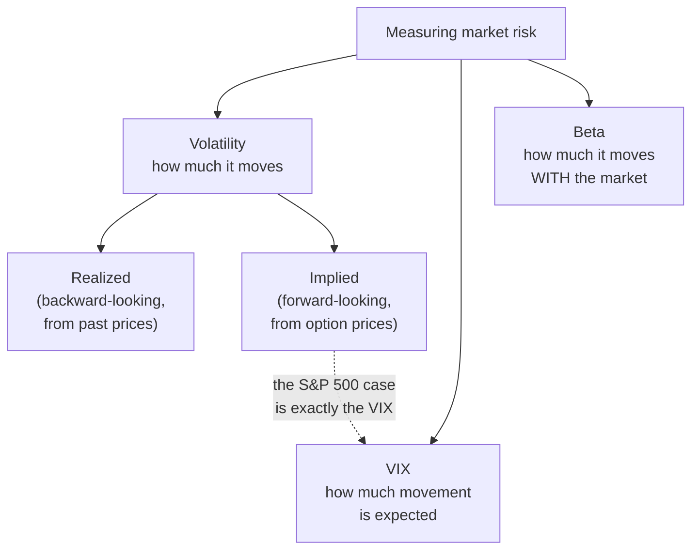

# Measuring Market Risk

Every investment carries risk. Since nobody can predict how markets will move, investors rely on a handful of measures that describe risk from different angles. The three most common are **volatility**, the **CBOE Volatility Index (VIX)**, and **beta**.

They answer three different questions. Volatility asks *how much does this asset move?* The VIX asks *how much movement is the market expecting?* Beta asks *how much does this asset move when the market moves?* Used together they give a far better picture than any one alone.



## Volatility

Volatility measures how much an asset's price changes over time. A highly volatile asset makes large swings; a low-volatility one moves gradually.

Crucially, volatility counts moves in **both** directions. A stock that regularly gains 5% and then loses 5% is more volatile than one that changes by 1% a day, even if both end the year in the same place. Higher volatility means more uncertainty — not that the investment is bad. It simply means returns are likely to vary more widely.

### Standard deviation

Standard deviation is the standard measure of volatility. It describes how far returns typically fall from their average:

$$
\sigma=\sqrt{\frac{\sum_{i=1}^{n}(R_i-\bar{R})^2}{n-1}}
$$

where $\sigma$ is the standard deviation, $R_i$ is each individual return, $\bar{R}$ the average return, and $n$ the number of observations. (The divisor is $n-1$ rather than $n$ because we estimated $\bar{R}$ from the same data — the quant tier derives why.)

Consider two portfolios:

- **Portfolio A** — 5% annual return, 4% standard deviation.
- **Portfolio B** — 15% annual return, 35% standard deviation.

B has the higher expected return but a far wider range of outcomes. In a given year B might lose 20% while A quietly returns 9%. Higher expected returns generally require tolerating a rougher ride.

```chart
bollinger_bands()
```

Bollinger Bands make volatility visible: the bands are drawn a fixed number of standard deviations from a moving average, so they widen mechanically when the market turns choppy and contract when it settles. The width of that channel *is* recent realised volatility, drawn on the price chart.

### Realized versus implied volatility

**Realized** (or historical) volatility looks backward, measuring how much prices actually moved over a past window. Investors use it to compare assets, study history, and estimate portfolio risk.

**Implied** volatility looks forward. It is backed out of option prices and reflects how much movement traders *expect*. When options get more expensive, implied volatility rises, because traders are paying up for protection against larger future moves.

The distinction matters: realized volatility is a measurement of what happened, implied volatility is a market expectation about what will happen. They frequently disagree.

## The VIX

The best-known implied-volatility measure is the **CBOE Volatility Index**. It estimates the expected volatility of the S&P 500 over the coming 30 days, derived from a broad strip of S&P 500 index option prices.

Despite the "fear index" nickname, the VIX does not forecast direction. It measures the *size* of expected moves, not their sign.

### Interpretation

A higher VIX means investors expect larger swings. Typical ranges:

- **Below 15** — low expected volatility, generally calm markets
- **15–25** — normal conditions
- **25–35** — elevated uncertainty
- **Above 35** — high expected volatility and heightened investor fear

During major dislocations the VIX can go far beyond this. It rose above 80 during both the 2008 financial crisis and the COVID-19 crash in March 2020.

### What pushes the VIX up

Recessions, surprise inflation data, central bank announcements, geopolitical conflict, financial crises, and earnings shocks all raise uncertainty. As uncertainty rises, demand for options — particularly protective puts — increases. Higher option demand raises option prices, which raises implied volatility, which raises the VIX.

```chart
normal_vs_fat_tail()
```

This chart shows why volatility spikes are more common than a simple bell curve suggests. Both distributions have the same standard deviation, but the fat-tailed one places far more probability in the extremes. Real market returns look like the fat-tailed curve, which is why "once in a century" moves seem to arrive every decade or so — and why a single volatility number never tells the whole story.

## Beta

Beta measures how sensitive an investment is to movements in the overall market. This differs from volatility, which measures how much an asset moves *on its own*, irrespective of cause.

Beta compares an asset's returns to a benchmark, most often the S&P 500, which is assigned a beta of 1.0 by definition:

$$
\beta=\frac{\text{Cov}(R_i,R_m)}{\text{Var}(R_m)}
$$

where $R_i$ is the investment's return and $R_m$ the market's return.

```chart
linear_regression_fit()
```

That formula is not arbitrary — it is exactly the slope of a best-fit line through a scatter of the asset's returns against the market's returns. Plot each day as a point and fit a line; beta is its steepness. The scatter around the line is the part of the asset's movement the market does not explain.

### Interpretation

- $\beta = 0$ — returns are uncorrelated with the market
- $0 < \beta < 1$ — moves with the market, but less sharply
- $\beta = 1$ — moves roughly in line with the market
- $\beta > 1$ — moves with the market, but more sharply
- $\beta < 0$ — tends to move opposite the market

### Example

Suppose the S&P 500 rises 10%. A stock with a beta of 1.5 would be expected to gain about 15%; if the index fell 10% instead, that stock would be expected to lose about 15%.

Now take a company with a beta of −0.5. If the market gains 10%, it would be expected to fall about 5%; if the market drops 10%, it would be expected to rise about 5%.

These are statistical expectations from historical relationships, not predictions. Actual returns routinely differ.

### High-beta and low-beta stocks

**High beta** tends to include technology companies, growth stocks, semiconductor manufacturers, and small caps. They often outperform in bull markets and fall harder in downturns.

**Low beta** tends to include utilities, consumer staples, healthcare providers, and large defensive companies. They usually swing less and can hold up better under stress.

### Limitations

- Beta is estimated from historical data and may not describe future behaviour.
- It captures only systematic (market-related) risk, not company-specific risks like poor management or a failed product.
- It drifts as a company's business model, leverage, or industry changes.
- In a crisis, correlations across stocks converge toward 1, so beta-based diversification weakens exactly when it is needed most.

Because of this, beta is used alongside other measures rather than on its own.

## Key takeaways

- Volatility measures the size of an asset's price swings, in both directions; standard deviation is the usual estimate.
- Realized volatility looks backward at what happened; implied volatility is backed out of option prices and looks forward.
- The VIX is 30-day implied volatility on the S&P 500 — a measure of expected movement, not of direction.
- Beta measures sensitivity to the market and is exactly the slope of a regression of asset returns on market returns.
- Returns have fatter tails than a normal distribution, so extreme moves are more likely than a single volatility figure implies.
- No one measure captures market risk; volatility, the VIX, and beta describe different facets and are best read together.

*Educational content, not investment advice.*
