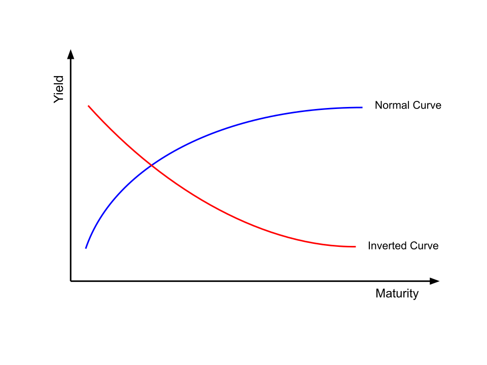

# Monetary Economics

# Introduction

Monetary economics is a branch of economics that studies money, and how it is created, managed, and deployed throughout an economy. It analyzes how the supply and price of money influence inflation, employment, output, and financial markets. At its core, monetary economics examines how changes in interest rates and the money supply affect economic activity. 

# Money

In economics, money is an item that is accepted as a form of payment for goods and services. To be considered money it must have these three primary functions. 

* **Medium of exchange**: money allows goods and services to be traded without requiring a direct exchange of goods   
* **Store of value**: money can retain purchasing power over time, allowing individuals to save and spend in the future  
* **Unit of account**: money provides a common measure for pricing goods and services

The money supply consists of different categories of liquid assets. There are different measures of the money that track the amount of currency in the money supply. M1 consists of highly liquid assets such as cash and demand deposits. M2 consists of all of M1 in addition to saving deposits, small CDs and other easily liquidated assets. 

# Interest rates 

Interest rates represent the costs of borrowing money and the return earned from lending money. Interest rates are central to monetary economics because they influence consumer spending, business investment, housing demand, and financial markets. 

When interest rates rise, borrowing becomes more expensive because the cost of borrowing increases, thus spending and investment typically decreases. Lower interest rates make borrowing cheaper which encourages spending and leads to a boost in economic activity. 

Interest rates also affect the valuations of stocks, bonds, and other financial assets. Since future cash flows are discounted using the current interest rates, higher rates generally place downward pressure on asset prices. This means that higher rates lead to lower stock prices.

# Inflation

Inflation is the rate at which the general price level of goods and services increases over time. A low and stable rate of  inflation is considered healthy for the economy because it encourages spending and investment while allowing wages and prices to adjust over time. While excessive inflation significantly reduces purchasing power and creates uncertainty for households and businesses. 

The Federal Reserve's long-run inflation target is 2%, which is measured by the Personal Consumption Expenditures Price (PCE) Index. They view this level as consistent with price stability and sustainable economic growth. 

# The Federal Reserve 

In the United States monetary policy is conducted by the Federal Reserve. The Fed has congressionally mandated goals which include maintaining low stable inflation (around 2%) and maximum sustainable employment. Sometimes these two goals can conflict with one another and the Fed has to make a judgement call about which problem is more urgent. 

The primary tool that the Fed uses to pursue these goals is the federal funds rate which is the interest rate at which commercial banks lend reserves to each other overnight. The Fed does not set the federal funds rate directly; rather it sets a target range (ex. 4.25% to 4.5%) and then uses open market operations to push the effective federal funds rate into that range. 

The Federal Open Market Committee (FOMC) meets eight scheduled times per year and votes on whether to raise, lower, or hold the target range for the federal funds rate. Increasing the rate makes borrowing more expensive, so mortgages, auto loans, and credit cards all become more costly. This then cools demand, reduces inflationary pressure, and slows hiring. Cutting rates does the opposite, and helps to stimulate the economy. 

The Fed also used forward guidance which is communicating their intentions for the future. For example when the Fed signals that rates will stay higher for longer, long-term interest rates often rise in response even before a raise in rates occurs. 

# Monetary Policy 

Monetary policy refers to the set of actions that a central bank takes to influence the money supply, interest rates, and overall economic activity. The central bank can take different actions such as changing interest rates, conducting open market operations, or changing reserve requirements to change the money supply. 

* **Open Market Operations**: the buying and selling of government securities to increase or decrease the amount of money in the economy. If the Fed sells Treasury securities to the public, buyers pay cash to the Fed, which reduces the money supply.   
* **Federal Funds Rate**: is the interest rate at which banks lend their excess reserved balances to each other. By raising the federal funds rate, it is more expensive for banks to borrow which gets passed to consumers which discourages spending.   
* **Reserve Requirements**: are the percentage of deposits that banks are required to hold as reserves rather than lend out. In March 2020, the Federal Reserve reduced reserve requirements to zero, making this tool largely inactive in modern monetary policy. 

After the 2008 financial crisis the Fed began to use quantitative easing and quantitative tightening as major monetary tools. When short-term interest rates are near zero, the Federal Reserve may use quantitative easing (QE), which involves purchasing large amounts of longer-term securities to lower interest rates and stimulate economic activity. Conversely, quantitative tightening (QT) reduces the size of the Fed's balance sheet and removes liquidity from the financial system.

## Expansionary Monetary Policy 

Expansionary monetary policy is used when the economy is slowing or unemployment is rising. The federal reserve could:

* Purchase government securities  
* Lower interest rates  
* Lower the reserve requirement   
* Quantitative easing 

These actions encourage borrowing, spending, and investment by putting more money into the economy.

## Contractionary Monetary Policy 

Contractionary monetary policy is used when inflation becomes too high.   
The Fed could:

* Sell government securities  
* Raise interest rates  
* Raise the reserve requirement  
* Quantitative tightening

These activities decrease the money supply which slow economic activity and help control inflationary pressures. 

# Economic data releases and market reactions 

Financial markets closely monitor economic data releases because they provide clues about future Federal Reserve policy decisions. Some of the most influential reports include: 

## Consumer Price Index (CPI)

CPI measures inflation experienced by consumers. Higher than expected inflation may lead investors to anticipate future interest rate increases because the Fed would likely raise rates to cool inflation. 

## Nonfarm Payrolls (NFP)

NFP is a jobs report that is published monthly by the US Bureau of Labor Statistics. The report measures employment growth and unemployment rates, strong labor market data can signal economic strength but may also contribute to inflationary pressures. 

## FOMC Statement

After each Federal Open Market Committee meeting, the Fed releases a statement explaining its policy decision and assessment of economic conditions. Investors analyze the language used in these statements for clues about future interest rate changes which can then trigger movements in financial markets. 

## Gross Domestic Product (GDP)

GDP measures the total market value of all final goods and services produced within an economy and is one of the primary indicators of economic growth.

## Retail Sales

Retail sales track consumer spending activity which accounts for a significant portion of US economic output. Since the Fed is highly dependent on data, these releases often trigger significant movements in stock, bond, and currency markets. 

# Repo and Reverse Repo Markets 

The repo market (repurchase agreement market) is a financial system where institutions can borrow and lend cash overnight. 

## Repo Agreements

In a repo transaction, one party sells securities (typically treasury securities) with an agreement to repurchase them later at a slightly higher price. Financial institutions use repos to obtain short-term funding to manage liquidity needs. 

## Reverse Repo Agreements

A reverse repo is the opposite side of the repo transaction. One party lends cash and receives Treasury securities as collateral, agreeing to return the securities later.

## How the Federal Reserve Uses Repos

### Repo Operations \= Adding Liquidity

When the Fed conducts a repo, they buy Treasuries from banks temporarily. The banks receive cash and their reserves increase. 

This means that more money is available in the financial system. This tends to put downward pressure on short-term interest rates.

### Reverse Repo Operations \= Draining Liquidity

When the Fed conducts a reverse repo they sell Treasuries temporarily. Investors give cash to the Fed, cash leaves the financial system, and bank reserves decrease.

This tends to put upward pressure on short-term interest rates or prevent them from falling too low.

# Secured Overnight Financing Rate (SOFR)

The Secured Overnight Financing Rate (SOFR) is the primary benchmark interest rate in the United States. It measures the cost of borrowing cash overnight when loans are secured by U.S. Treasury securities through the repurchase agreement (repo) market.

SOFR is calculated from a large volume of actual overnight repo transactions, making it a transparent and reliable measure of short-term borrowing costs. It replaced the London Interbank Offered Rate (LIBOR), which was based on bank estimates rather than market transactions.

SOFR closely follows the federal funds rate, but the two measure different markets. The federal funds rate reflects unsecured overnight lending between banks, while SOFR reflects secured borrowing backed by Treasury securities.

Since SOFR serves as the benchmark for trillions of dollars of loans, mortgages, bonds, and derivatives, investors closely monitor it as an indicator of short-term interest rates and overall funding conditions in the financial system.

# Treasury Securities

The US Treasury issues securities to finance government operations and manage national debt. 

Major Treasury instruments include:

* Treasury Bills (maturities are under one year)  
* Treasury Notes (2-10 years)  
* Treasury Bonds (20–30 years)

Treasury securities are often considered the safest investments and "risk-free" because they are backed by the full faith and credit of the US government. As a result, Treasury yields serve as benchmarks for pricing mortgages, corporate bonds, and many other financial assets.

# Yield Curves

The yield curve plots Treasury yields across different maturities. Under normal economic conditions, longer term bonds typically offer higher yields than shorter term bonds because investors require additional compensation for uncertainty over time. 

The yield curve provides insight into investor expectations for economic growth, inflation, and future Federal Reserve policy. It summarizes information from millions of market participants and economists, so investors often view it as one of the most important indicators of future economic conditions.

## Normal Yield Curve

A normal yield curve slopes upward meaning long term bonds have higher yields. This reflects expectations of economic growth and moderate inflation. 

## Inverted Yield Curve 

An inverted yield curve occurs when short-term interest rates are higher than long-term interest rates. 

Historically, inverted yield curves have often preceded economic recessions because they reflect investors' expectations about future economic conditions and monetary policy. When investors anticipate slower economic growth, they expect the Federal Reserve to lower interest rates in the future. As a result, they increase their demand for long-term bonds to lock in current yields before rates decline. This increased demand raises bond prices and pushes long-term yields lower, sometimes causing them to fall below short-term interest rates and resulting in an inverted yield curve.

# Why Monetary Economics Matter 

Monetary economics explains how money, interest rates, inflation, and central bank actions influence both the broader economy and financial markets. Decisions that are made by the Fed affect mortgage rates, business investment, stock valuation, bond yields, and more. 

Whether analyzing inflation reports, interpreting Federal Reserve decisions, or evaluating movements in bond markets, understanding monetary economics is essential for explaining how financial markets and the broader economy interact.
