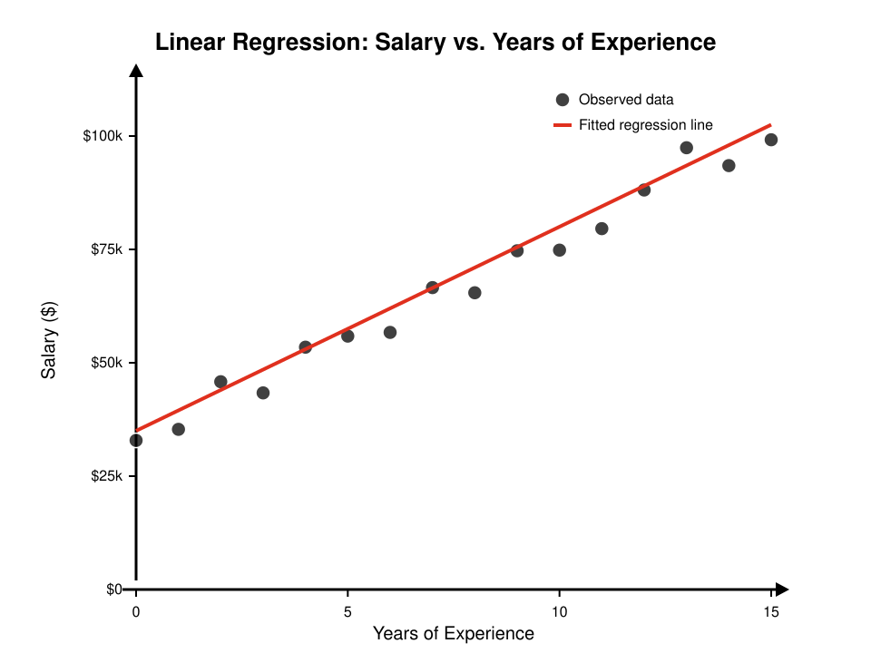
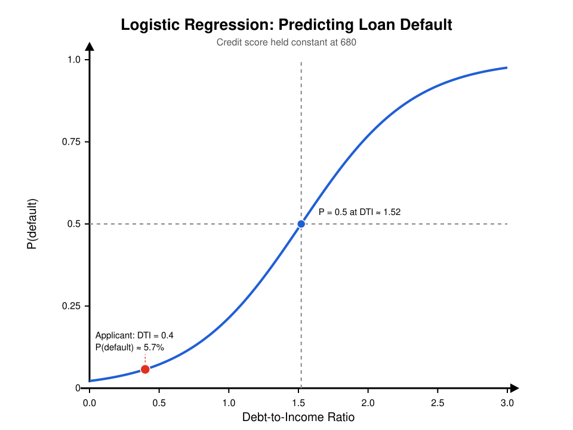

# Linear and Logistic Regression

## Introduction

Regression is the foundation of predictive modeling. Whether you're forecasting next quarter's revenue, estimating the probability that a borrower will default on a loan, or understanding the relationship between interest rates and bond prices, regression provides a mathematical framework for making these predictions.

Linear regression answers questions such as "how does an additional year of education affect income?" It models a continuous outcome as a weighted sum of inputs. In other words, it is drawing the best possible straight line through a bunch of data points.

Logistic regression answers questions like "will this borrower default on their loan?" It models the probability of a binary outcome, rather than predicting a number. This looks like predicting that the outcome is yes or no.

While used in different scenarios, these two models both have the same underlying logic. They both express an outcome from a combination of inputs. Understanding both models is essential for anyone working with data.

## Linear Regression

Linear regression models the continuous relationship between a dependent variable and one or more independent variables. Its goal is to find the best-fitting straight line through the data points so that it can predict future values.

### Simple Linear Regression

The simplest form of linear regression involves a single predictor. The equation for this model is:

$$\hat{y} = \beta_0 + \beta_1 x_1 + \varepsilon$$

- $\hat{y}$ is the predicted value of the dependent variable.
- $x$ is the predictor or the independent variable.
- $\beta_1$ is the coefficient which tells you how much $\hat{y}$ changes for every one-unit increase in $x$.
- $\beta_0$ is the intercept which tells you the expected value of $\hat{y}$ when $x = 0$.
- $\varepsilon$ is the error term (residuals) which is the true value of $y$ minus the predicted value of $y$ ($\hat{y}$). Residuals capture everything that the data didn't explain.

#### Example

Suppose you want to predict an employee's annual salary ($y$) based on years of work experience ($x$). Your model would look like:

$$\text{Salary} = \beta_0 + \beta_1(\text{years of experience}) + \varepsilon$$

After running the regression you find that:

$$\text{Salary} = 35{,}000 + 4{,}500 \times (\text{years of experience})$$

This means that a new hire with zero years of experience is predicted to earn \$35,000 (the intercept), and that every additional year is associated with a \$4,500 increase in salary. So an employee with 5 years of experience would be predicted to earn $35,000 + 4,500 * (5) = $57,500.

### Multiple Linear Regression

In the real world, outcomes are rarely driven by a single variable, but rather by multiple factors. Multiple linear regression extends the SLR model by adding more predictors.

$$\hat{y} = \beta_0 + \beta_1 x_1 + \beta_2 x_2 + \cdots + \beta_n x_n + \varepsilon$$

Building on the salary example, realistically there are other factors that contribute to income other than just years of experience. The old model then becomes:

$$\text{Salary} = \beta_0 + \beta_1(\text{years of experience}) + \beta_2(\text{years of education}) + \varepsilon$$

After running the regression you find that:

$$\text{Salary} = 20{,}000 + 4{,}500 \times (\text{years of experience}) + 2{,}800 \times (\text{years of education})$$

This model controls for both variables at the same time. The coefficient of experience (4,500) tells you the expected change in salary for one additional year of experience, holding education constant. The reason why MLR gives a more accurate prediction is because it isolates the contribution of each variable while accounting for the others.

### How Linear Regression is Fitted

The most common method for fitting a regression line is by using Ordinary Least Squares (OLS). In linear regression, the goal is to find the line that best represents the data. OLS does this by finding the line that minimizes the sum of squared residuals (SSR). Since residuals are the gaps between the predicted value and the actual observed value, OLS minimizes these gaps, producing the line of best fit.

$$\text{SSR} = \sum (y_i - \hat{y}_i)^2$$

In the equations, the residuals are squared for two reasons. The first is that it ensures that the positive and negative residuals don't cancel each other out. The second is that it penalizes large errors more than small ones.

### Evaluating Model Fit

Once the regression has been run, you need to assess how well it was able to predict the outcome.

**Mean Squared Error (MSE)** measures the average squared gap between the predicted and actual values:

$$\text{MSE} = \frac{1}{n} \sum (y_i - \hat{y}_i)^2$$

A lower MSE indicates a better-fitting model. The units of MSE are the squared units of the outcome variable. Since those units are hard to directly interpret, you can take the square root which would give you the Root Mean Squared Error (RMSE). This gives you the same units as $y$ which is easier to understand intuitively.

**R² (R-Squared)** measures the proportion of variance in $y$ that is explained by the model:

$$R^2 = 1 - \frac{\text{SSR}}{\text{SST}}$$

SSR is the sum of squared residuals and SST is the total sum of squares (the variance of $y$ around its mean). $R^2$ ranges from 0 to 1. So an $R^2$ of 0.85 means that the regression explains 85% of the variation in the outcome and the remaining 15% is unexplained by the predictors.

A high $R^2$ does not always mean that the regression is an accurate prediction. Adding more variables to the model will increase the $R^2$ value, even if those additional variables aren't predicting anything new. Adjusted $R^2$ corrects for this by penalizing for additional predictors that don't improve accuracy.

### Assumptions

Linear regression relies on several key assumptions:

- Linearity between predictors and the outcome
- Independence of observations
- Constant variance of residuals (homoskedasticity)
- Residuals are approximately normally distributed
- Limited multicollinearity among predictors

Violations of these assumptions can lead to biased or inefficient estimates.

### Applications

Linear regression has many uses in quantitative finance and trading. Common applications include:

- **Beta Estimation:** Regressing a stock's returns against market returns to measure systemic risk. The slope coefficient is the stock's beta.
- **Pairs Trading:** Fitting a regression between two correlated securities to identify when the spread between the two has deviated from its historical norm, generating a mean reversion signal.
- **Yield Curve Modeling:** Regressing bond yields on macroeconomic variables such as inflation expectations, GDP growth, and central bank policy rates.

### Pros and Cons

**Pros:**
- Easy to understand and interpret
- Works quickly even with large datasets
- Helps measure uncertainty through statistical tests and confidence intervals
- Performs well when the relationship between the variables is roughly linear

**Cons:**
- Assumes a linear relationship even if they aren't
- Sensitive to outliers which can distort results
- Highly correlated predictors can make results harder to interpret
- Can't be used to handle binary or categorical outcomes

## Logistic Regression

Logistic regression is a model used for classification problems. Specifically when you want to predict a category rather than a continuous numerical value. Logistic regression is most commonly used when the outcome is binary – 0 or 1, yes or no, default or no default.

If you were to apply linear regression to a classification problem, then the predicted values could fall below 0 or above 1 which would not make sense when interpreting the outcomes as probabilities. Logistic regression solves this problem by transforming the linear inputs into an output that falls between 0 and 1 that can be interpreted as a probability of the outcome happening or not.

### Logistic Regression Equation

Logistic regression models the probability that the outcome equals 1:

$$P(y = 1) = \frac{1}{1 + e^{-(\beta_0 + \beta_1 x_1 + \beta_2 x_2 + \cdots + \beta_n x_n)}}$$

Or equivalently, $P = \frac{1}{1 + e^{-z}}$ where $z = \beta_0 + \beta_1 x_1 + \beta_2 x_2 + \cdots + \beta_n x_n$.

The function $\frac{1}{1 + e^{-z}}$ is called the sigmoid (logistic) function. It takes any real number as an input and puts it into the interval $(0, 1)$. The quantity $z = \beta_0 + \beta_1 x_1 + \cdots + \beta_n x_n$ represents the log-odds (or logit) of the outcome.

The components of the equation are similar to linear regression:

- $P(y = 1)$ is the predicted probability of the positive classification (e.g., yes or probability of default)
- $x_1, x_2, \ldots$ are the independent variables or predictors
- $\beta_1, \beta_2, \ldots$ are the coefficients – a positive $\beta_1$ means that increasing $x_1$ increases the probability of the outcome being equal to one. A negative $\beta_1$ means the opposite.
- $\beta_0$ is the intercept which represents the log-odds when all predictors are equal to zero

### Example

Suppose you want to predict whether a loan applicant will default ($y = 1$) based on their **debt-to-income ratio** ($x_1$) and their **credit score** ($x_2$). Your model would look like:

$$
P(\text{default}) = \frac{1}{1 + e^{-(\beta_0 + \beta_1 \cdot \text{debt-to-income ratio} + \beta_2 \cdot \text{credit score})}}
$$

After running the regression, you find that:

$$
P(\text{default}) = \frac{1}{1 + e^{-(3 + 2.5 \cdot \text{debt-to-income ratio} \ - \ 0.01 \cdot \text{credit score})}}
$$

The signs here make intuitive sense — $\beta_1$ is positive because a higher debt-to-income ratio should *increase* default risk, while $\beta_2$ is negative because a higher credit score should *decrease* default risk.

For an applicant with a debt-to-income ratio of **0.4** and a credit score of **680**:

**Step 1 — Compute the linear combination inside the exponent:**

$$
3 + 2.5(0.4) - 0.01(680) = 3 + 1.0 - 6.8 = -2.8
$$

**Step 2 — Plug into the sigmoid function:**

$$
P(\text{default}) = \frac{1}{1 + e^{-(-2.8)}} = \frac{1}{1 + e^{2.8}} = \frac{1}{1 + 16.44} \approx 0.057
$$

This model predicts a **5.7% probability** that the applicant will default, suggesting the borrower is relatively low risk, though not negligible.

### How Logistic Regression is Fitted

Unlike linear regression, which fits a straight line, logistic regression uses the logistic (sigmoid) function to model probabilities, producing an S-shaped curve.

This curve is fitted by using the Maximum Likelihood Estimation (MLE). MLE finds the coefficients that make the observed data most probable under the model. For each observation the model assigns a predicted probability. MLE maximizes the log-likelihood function:

$$\ell(\beta) = \sum \left[ y_i \log(\hat{p}_i) + (1 - y_i) \log(1 - \hat{p}_i) \right]$$

$\hat{p}_i$ is the model's predicted probability for an observation $i$. When $y = 1$, the model is rewarded for predicting a high probability. When $y = 0$ it is rewarded for predicting a low probability.

### Evaluating Model Fit

Since logistic regression predicts probabilities, there are different evaluation metrics than used for linear regression.

**AUC-ROC (Area Under the Curve – Receiver Operating Characteristic)** is a standard metric for binary classifiers. The ROC curve plots the true positive rate against the false positive rate at different classification thresholds. If the AUC is 1 that means that it is a perfect classifier where an AUC of 0.5 is the same as choosing randomly. For example a model with an AUC of 0.85 correctly ranks a randomly chosen positive case above a randomly chosen negative case 85% of the time.

**Log-loss (binary cross-entropy)** measures how well the predicted probabilities align with the true outcome where the model is penalized heavily for confident wrong predictions.

Since logistic regression does not have a traditional $R^2$ statistic like linear regression, analysts often use **Pseudo $R^2$** metrics. Measures such as McFadden's $R^2$ compares the fitted model's log-likelihood to that of a null model with no predictors.

$$R^2_{\text{McFadden}} = 1 - \frac{\ln(L_{\text{model}})}{\ln(L_{\text{null}})}$$

Where:
- $L_{\text{model}}$ is the likelihood of the fitted model
- $L_{\text{null}}$ is the likelihood of a model containing only an intercept

Unlike traditional $R^2$ values, pseudo $R^2$ values tend to be much lower. Values between 0.2 and 0.4 are considered indicative of a strong logistic regression model.

### Assumptions

Logistic regression has similar assumptions to the linear ones, with some differences:

- Independence of observations
- Linear relationship between predictors and the log-odds of the outcome
- Limited multicollinearity among predictors
- Sufficient sample size (10 to 15 events per variable)
- No extreme outliers that dominate the estimation process

### Applications

Logistic regression is widely used in finance for classification and risk tasks:

- **Credit Scoring:** Predicting the probability of loan defaults based on borrower characteristics, forming the basis of credit risk models used by banks and rating agencies.
- **Fraud Detection:** Classifying transactions as fraudulent or not based on the amount, location, merchant type, and behavioral patterns.
- **Earnings Surprise Predictions:** Classifying whether a company will beat or miss analyst earnings estimates based on pre-announcement financial and market signals.

### Pros and Cons

**Pros:**
- Predicts probabilities, making it useful for decision-making and risk analysis
- Easy to interpret and computationally efficient
- Works well with multiple predictor variables
- Well-suited for binary classification problems

**Cons:**
- Assumes a linear relationship between the predictors and the log-odds of the outcome
- Not as reliable for complex nonlinear problems
- Requires that observations are independent from each other
- Highly correlated predictors can reduce the reliability of coefficient estimates

## Conclusion

Linear and logistic regression are two important tools in statistics, machine learning, and quantitative finance. Both models attempt to explain an outcome using a set of predictors, but they are designed for different types of problems. Linear regression is used when the outcome is continuous, such as stock returns, salaries, or bond yields, while logistic regression is used when the outcome is categorical, such as default versus no default or fraud versus legitimate transactions.

Despite their differences, both methods provide interpretable frameworks for understanding relationships in data and making predictions. Their simplicity and interpretability make these models foundational tools.

Below is a quick comparison of the two models:

| Feature | Linear Regression | Logistic Regression |
|---|---|---|
|**Primary Purpose** | Predict a continuous numerical value | Predict the probability of a categorical outcome |
|**Outcome Variable** | Continuous (e.g., salary, stock return, house price) | Binary or categorical (e.g., default/no default, fraud/not fraud) |
|**Output** | A numerical prediction | A probability between 0 and 1 that can be converted into a classification |
|**General Equation** | $\hat{y} = \beta_0 + \beta_1 x_1 + \cdots + \beta_n x_n + \varepsilon$ | $P(y=1) = \frac{1}{1 + e^{-(\beta_0 + \beta_1 x_1 + \cdots + \beta_n x_n)}}$ |
|**Relationship Modeled** | Linear relationship between predictors and the outcome | Linear relationship between predictors and the log-odds of the outcome |
|**Fitting Method** | Ordinary Least Squares (OLS) | Maximum Likelihood Estimation (MLE) |
|**Objective Function** | Minimize the Sum of Squared Residuals (SSR) | Maximize the log-likelihood function |
|**Prediction Range** | $(-\infty, +\infty)$ | $(0, 1)$ |
|**Interpretation of Coefficients** | Change in the predicted outcome for a one-unit increase in a predictor | Change in the log-odds of the outcome for a one-unit increase in a predictor |
|**Common Evaluation Metrics** | MSE, RMSE, R², Adjusted R² | AUC-ROC, Log-Loss, Pseudo R², Accuracy |
|**Key Assumption** | Linear relationship between predictors and the outcome variable | Linear relationship between predictors and the log-odds of the outcome |
|**Typical Finance Applications** | Beta estimation, yield curve modeling, asset pricing, pairs trading | Credit scoring, fraud detection, default prediction, earnings surprise classification |
|**Main Strength** | Highly interpretable and easy to implement | Produces interpretable probabilities for classification problems |
|**Main Limitation** | Cannot model categorical outcomes effectively | Cannot naturally capture complex nonlinear relationships without additional features |
